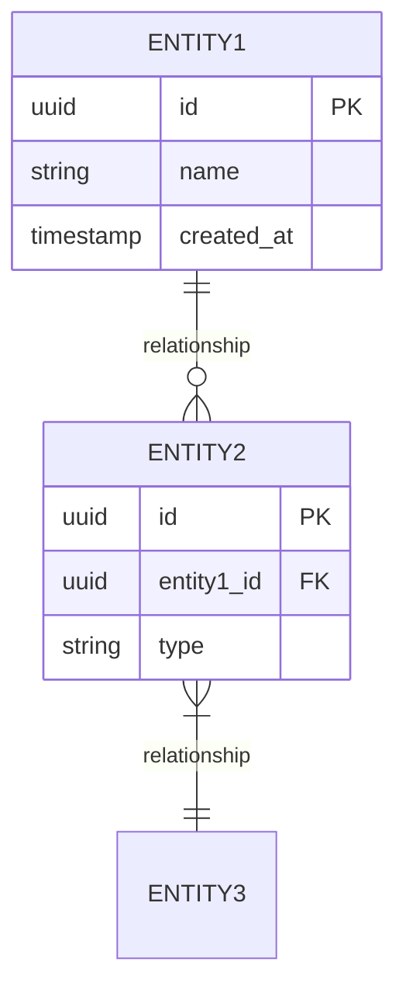

# Information View: [SUB_SYSTEM_NAME]

**Sub-System**: [SUB_SYSTEM_NAME]
**ADRs Referenced**: [ADR_IDS]
**Generated**: [DATE]
**Dependencies**: Functional View

---

## 3.3 Information View

**Purpose**: Describe data storage, management, and flow

### 3.3.1 Data Entities

| Entity | Storage Location | Owner Component | Lifecycle | Access Pattern |
|--------|------------------|-----------------|-----------|----------------|
| [ENTITY_1] | [e.g., PostgreSQL] | [e.g., UserService] | [e.g., Create-Update-Archive] | [e.g., Read-heavy] |

### 3.3.2 Data Model

### 3.3.3 Data Flow

**Key Data Flows:**

1. **[Flow Name]**: [Source] -> [Transformation] -> [Destination]
2. **[Flow Name]**: [Description of data movement]

### 3.3.4 Data Quality & Integrity

- **Consistency Model**: [e.g., Eventual, Strong, ACID]
- **Validation Rules**: [Key data validation points]
- **Retention Policy**: [Data lifecycle requirements]
- **Backup Strategy**: [Backup approach]

---

## Perspective Considerations

_The following perspectives are applied to this view based on system requirements._

### Security Considerations

[Security concerns - e.g., data classification, encryption, PII handling, access controls]
[See: templates/perspectives/security.md]

_Source ADRs: [ADR-XXX]_

### Performance Considerations

[Performance concerns - e.g., query patterns, data volume, indexing strategy]
[See: templates/perspectives/performance.md]

_Source ADRs: [ADR-XXX]_

### Regulation Considerations

[Regulation concerns - e.g., data governance, retention, privacy requirements]
[See: templates/perspectives/regulation.md]

_Source ADRs: [ADR-XXX]_

### Evolution Considerations

[Evolution concerns - e.g., schema evolution, data migration strategies]
[See: templates/perspectives/evolution.md]

_Source ADRs: [ADR-XXX]_

---

**ADR Traceability:**

| ADR | Decision | Impact on Information View |
|-----|----------|----------------------------|
| [ADR-XXX] | [Decision] | [How it affects this view] |
