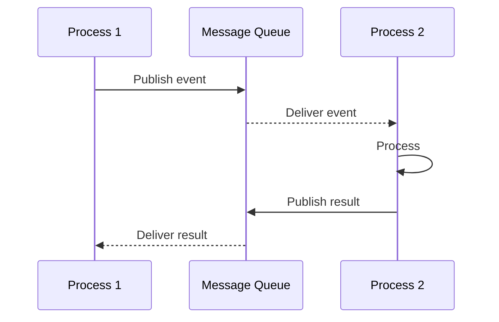

# Concurrency View: [SUB_SYSTEM_NAME]

**Sub-System**: [SUB_SYSTEM_NAME]
**ADRs Referenced**: [ADR_IDS]
**Generated**: [DATE]
**Dependencies**: Functional View, Deployment View
**Optional**: Yes - include only when async/multi-threaded patterns are significant

---

## 3.4 Concurrency View

**Purpose**: Describe runtime processes, threads, and coordination

**Note**: This is an optional view. Include for async/multi-threaded systems.

### 3.4.1 Process Structure

| Process | Purpose | Scaling Model | State Management |
|---------|---------|---------------|------------------|
| [PROCESS_1] | [e.g., API Server] | [e.g., Horizontal - stateless] | [Stateless/Stateful] |

### 3.4.2 Thread Model

- **Threading Strategy**: [e.g., Thread pool, Event-driven async]
- **Async Patterns**: [e.g., Async/await, reactive streams]
- **Resource Pools**: [e.g., Database connection pool]

### 3.4.3 Coordination Mechanisms

- **Synchronization**: [e.g., Distributed locks via Redis]
- **Communication**: [e.g., Message queues, event bus]
- **Deadlock Prevention**: [e.g., Lock ordering, timeouts]

### 3.4.4 Concurrency Diagram

---

**ADR Traceability:**

| ADR | Decision | Impact on Concurrency View |
|-----|----------|----------------------------|
| [ADR-XXX] | [Decision] | [How it affects this view] |
