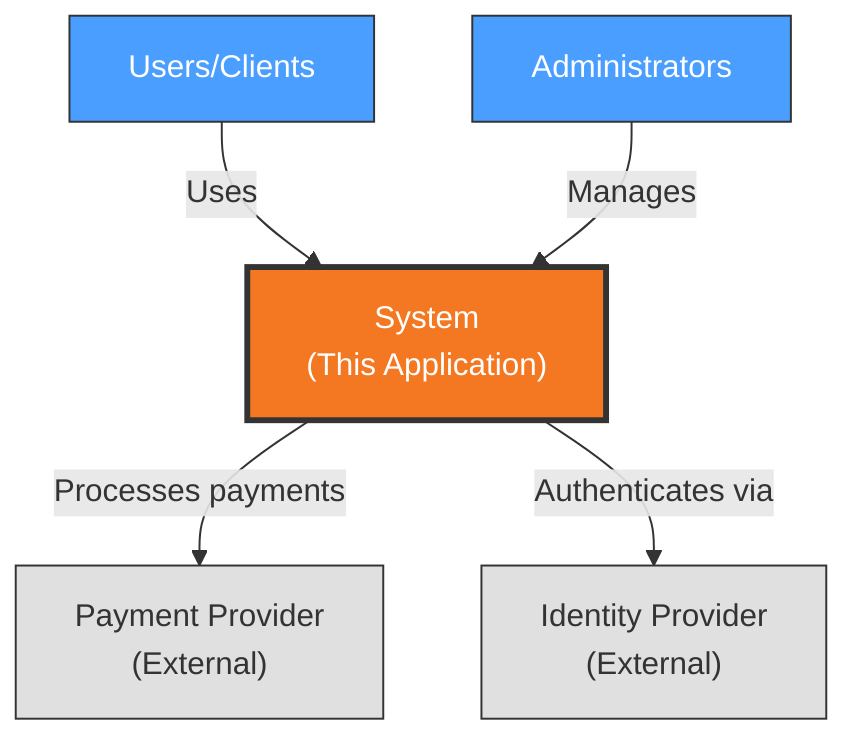

# Context View: [SUB_SYSTEM_NAME]

**Sub-System**: [SUB_SYSTEM_NAME]
**ADRs Referenced**: [ADR_IDS]
**Generated**: [DATE]

---

## 3.1 Context View

**Purpose**: Define system scope and external interactions

### 3.1.1 System Scope

[High-level description of what the system does and its boundaries]

### 3.1.2 External Entities

| Entity | Type | Interaction Type | Data Exchanged | Protocols |
|--------|------|------------------|----------------|-----------|
| [ENTITY_1] | User/System/API | [e.g., REST API, UI] | [e.g., User credentials] | [e.g., HTTPS] |
| [ENTITY_2] | [External System] | [Integration method] | [Data format] | [Protocol] |

### 3.1.3 Context Diagram

> **CRITICAL: Blackbox Requirement** - The system MUST appear as a single node. Do NOT show internal databases, services, or caches here (those belong in Deployment/Functional views).

### 3.1.4 External Dependencies

| Dependency | Purpose | SLA Expectations | Fallback Strategy |
|------------|---------|------------------|-------------------|
| [DEPENDENCY_1] | [Purpose] | [e.g., 99.9% uptime] | [e.g., Cache, degraded mode] |

---

**Validation Checklist** (verify before finalizing):

- [ ] System appears as exactly ONE node
- [ ] No internal databases shown (e.g., PostgreSQL, Redis)
- [ ] No internal services shown (e.g., AuthService, UserService)
- [ ] All entities are either stakeholders OR external systems
- [ ] All connections cross the system boundary
