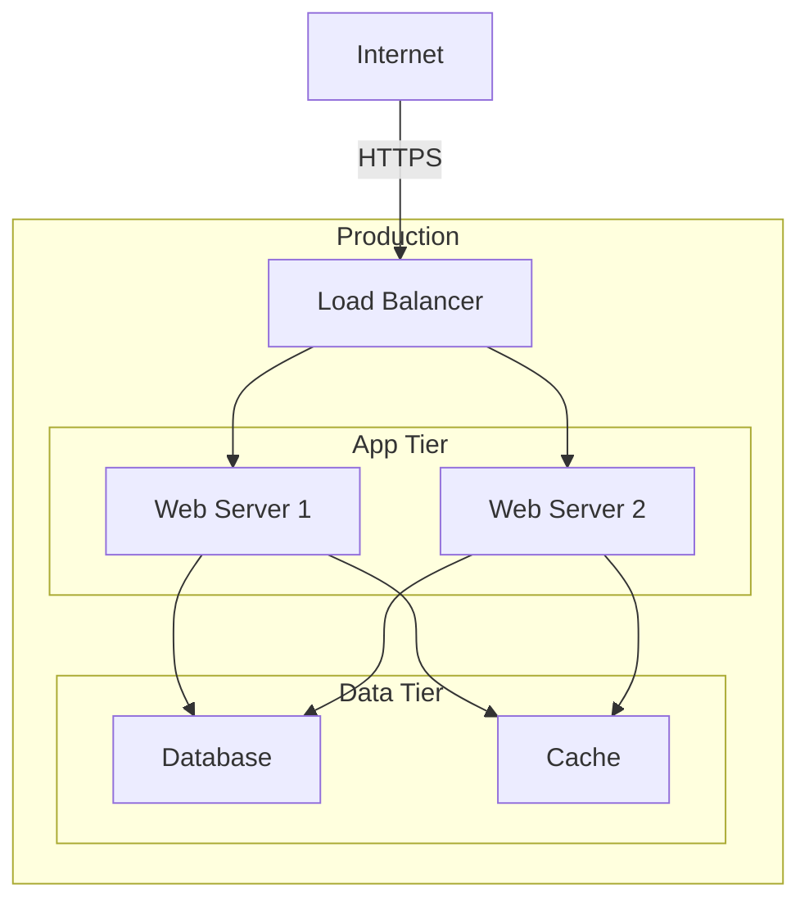

# Deployment View: [SUB_SYSTEM_NAME]

**Sub-System**: [SUB_SYSTEM_NAME]
**ADRs Referenced**: [ADR_IDS]
**Generated**: [DATE]
**Dependencies**: Context View, Functional View

---

## 3.6 Deployment View

**Purpose**: Physical environment - nodes, networks, storage

### 3.6.1 Runtime Environments

| Environment | Purpose | Infrastructure | Scale |
|-------------|---------|----------------|-------|
| Production | Live users | [e.g., AWS EKS] | [e.g., 10 nodes] |
| Staging | Pre-release | [e.g., AWS EKS] | [e.g., 3 nodes] |
| Development | Dev testing | [e.g., Docker Compose] | [e.g., 1 node] |

### 3.6.2 Network Topology

### 3.6.3 Hardware Requirements

| Component | CPU | Memory | Storage |
|-----------|-----|--------|---------|
| Web Server | [e.g., 2 cores] | [e.g., 4GB] | [e.g., 20GB] |
| Database | [Specs] | [Specs] | [Specs] |

### 3.6.4 Third-Party Services

| Service | Purpose | Provider | Tier |
|---------|---------|----------|------|
| [SERVICE_1] | [Purpose] | [Provider] | [Tier] |

---

**ADR Traceability:**

| ADR | Decision | Impact on Deployment View |
|-----|----------|---------------------------|
| [ADR-XXX] | [Decision] | [How it affects this view] |
