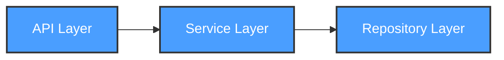

# Development View: [SUB_SYSTEM_NAME]

**Sub-System**: [SUB_SYSTEM_NAME]
**ADRs Referenced**: [ADR_IDS]
**Generated**: [DATE]
**Dependencies**: Functional View

---

## 3.5 Development View

**Purpose**: Constraints for developers - code organization, dependencies, CI/CD

### 3.5.1 Code Organization

```text
project-root/
├── src/
│   ├── api/              # API endpoints
│   ├── services/         # Business logic
│   ├── models/           # Data models
│   └── repositories/     # Data access
├── tests/
│   ├── unit/
│   ├── integration/
│   └── e2e/
└── infra/                # Infrastructure as code
```

### 3.5.2 Module Dependencies

**Dependency Rules:**

- API layer depends on Services layer (not vice versa)
- Services layer depends on Repositories layer
- No circular dependencies allowed



### 3.5.3 Build & CI/CD

- **Build System**: [e.g., npm, gradle, cargo]
- **CI Pipeline**: [Key stages]
- **Deployment Strategy**: [e.g., Blue-green, rolling]

### 3.5.4 Development Standards

- **Coding Standards**: [e.g., ESLint config, PEP 8]
- **Review Requirements**: [e.g., 2 approvals]
- **Testing Requirements**: [e.g., 80% coverage]

---

**ADR Traceability:**

| ADR | Decision | Impact on Development View |
|-----|----------|----------------------------|
| [ADR-XXX] | [Decision] | [How it affects this view] |
