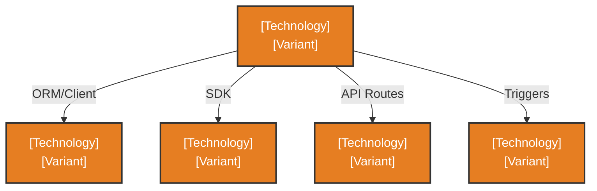

# Development View: [SUB_SYSTEM_NAME]

**Sub-System**: [SUB_SYSTEM_NAME]
**ADRs Referenced**: [ADR_IDS]
**Generated**: [DATE]
**Dependencies**: Functional View

---

## 3.5 Development View

**Purpose**: Constraints for developers - code organization, dependencies, CI/CD

> This view maps Functional View §3.2 architectural roles to specific technologies. See §3.5.2 for the technology stack mapping.

### 3.5.1 Code Organization

```text
project-root/
├── src/
│   ├── api/              # API endpoints
│   ├── services/         # Business logic
│   ├── models/           # Data models
│   └── repositories/     # Data access
├── tests/
│   ├── unit/
│   ├── integration/
│   └── e2e/
└── infra/                # Infrastructure as code
```

### 3.5.2 Technology Stack Mapping

Maps Functional View (§3.2) architectural roles to concrete technology choices.

| Functional Role | Technology Choice | Version/Variant | ADR Reference |
|-----------------|-------------------|-----------------|---------------|
| App Shell | [e.g., Next.js 14] | [e.g., App Router] | [ADR-XXX] |
| Database | [e.g., Neon PostgreSQL] | [e.g., Serverless] | [ADR-XXX] |
| Object Storage | [e.g., Vercel Blob] | | [ADR-XXX] |
| AI Gateway | [e.g., Vercel AI Gateway] | | [ADR-XXX] |
| Workflow Runtime | [e.g., Vercel Workflow] | | [ADR-XXX] |

**Mapping Rules:**
- N:1 mappings allowed (multiple functional elements → one technology)
- Every technology choice MUST reference a supporting ADR
- Generic roles (Database) map to specific products (Neon PostgreSQL)

### 3.5.3 Technology Architecture

Concrete instantiation of Functional View §3.2.2 element interactions using specific technologies.



**Diagram Guidelines:**
- Mirror the structure of Functional View §3.2.2
- Replace generic labels with concrete technology names
- Include connection mechanisms (SDK, ORM, API, etc.)

### 3.5.4 Module Dependencies

**Dependency Rules:**

- API layer depends on Services layer (not vice versa)
- Services layer depends on Repositories layer
- No circular dependencies allowed


### 3.5.5 Build & CI/CD

- **Build System**: [e.g., npm, gradle, cargo]
- **CI Pipeline**: [Key stages]
- **Deployment Strategy**: [e.g., Blue-green, rolling]

### 3.5.6 Development Standards

- **Coding Standards**: [e.g., ESLint config, PEP 8]
- **Review Requirements**: [e.g., 2 approvals]
- **Testing Requirements**: [e.g., 80% coverage]

---

## Perspective Considerations

_The following perspectives are applied to this view based on system requirements._

### Security Considerations

[Security concerns - e.g., SAST/DAST integration, secure coding standards, dependency scanning]
[See: templates/perspectives/security.md]

_Source ADRs: [ADR-XXX]_

### Performance Considerations

[Performance concerns - e.g., build/test performance, development environment responsiveness]
[See: templates/perspectives/performance.md]

_Source ADRs: [ADR-XXX]_

### Evolution Considerations

[Evolution concerns - e.g., modular design, build systems, maintainability]
[See: templates/perspectives/evolution.md]

_Source ADRs: [ADR-XXX]_

### Development Resource Considerations

[Development resource concerns - e.g., team skills, tooling, build process optimization]
[See: templates/perspectives/development-resource.md]

_Source ADRs: [ADR-XXX]_

---

## Validation Checklist

Before finalizing this view, verify:

- [ ] **Technology Mapping**: Every Functional View §3.2 element has a corresponding entry in §3.5.2 (N:1 mappings acceptable)
- [ ] **ADR References**: Every technology choice in §3.5.2 references a supporting ADR
- [ ] **Diagram Parity**: Technology Architecture diagram (§3.5.3) mirrors Functional View diagram structure
- [ ] **Code Alignment**: Code organization reflects the technology stack choices
- [ ] **Dependency Rules**: Module dependencies are consistent with technology constraints

---

**ADR Traceability:**

| ADR | Decision | Impact on Development View |
|-----|----------|----------------------------|
| [ADR-XXX] | [Decision] | [How it affects this view] |
