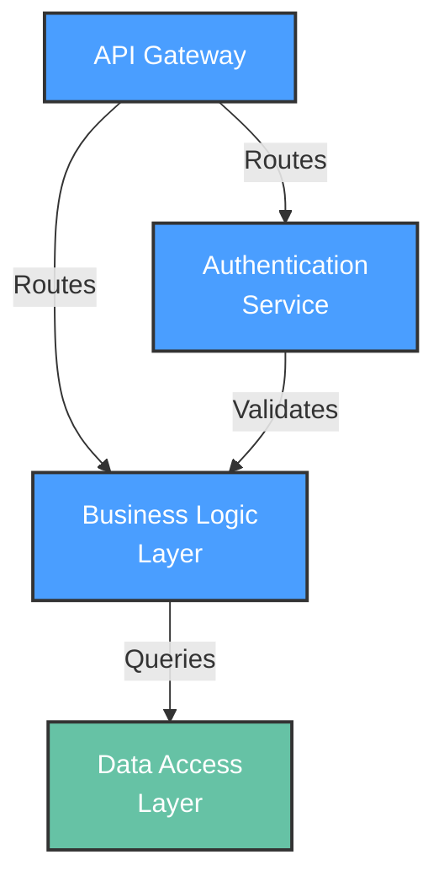

# Functional View: [SUB_SYSTEM_NAME]

**Sub-System**: [SUB_SYSTEM_NAME]
**ADRs Referenced**: [ADR_IDS]
**Generated**: [DATE]
**Dependencies**: Context View

---

## 3.2 Functional View

**Purpose**: Describe functional elements, their responsibilities, and interactions

### 3.2.1 Functional Elements

| Element | Responsibility | Interfaces Provided | Dependencies |
|---------|----------------|---------------------|--------------|
| [COMPONENT_1] | [e.g., User authentication] | [e.g., REST /auth/*] | [e.g., Database] |
| [COMPONENT_2] | [Responsibility] | [Interfaces] | [Dependencies] |

### 3.2.2 Element Interactions

### 3.2.3 Functional Boundaries

**What this system DOES:**

- [Functionality 1]
- [Functionality 2]

**What this system does NOT do:**

- [Excluded functionality 1]
- [Excluded functionality 2]

---

**ADR Traceability:**

| ADR | Decision | Impact on Functional View |
|-----|----------|---------------------------|
| [ADR-XXX] | [Decision] | [How it affects this view] |
