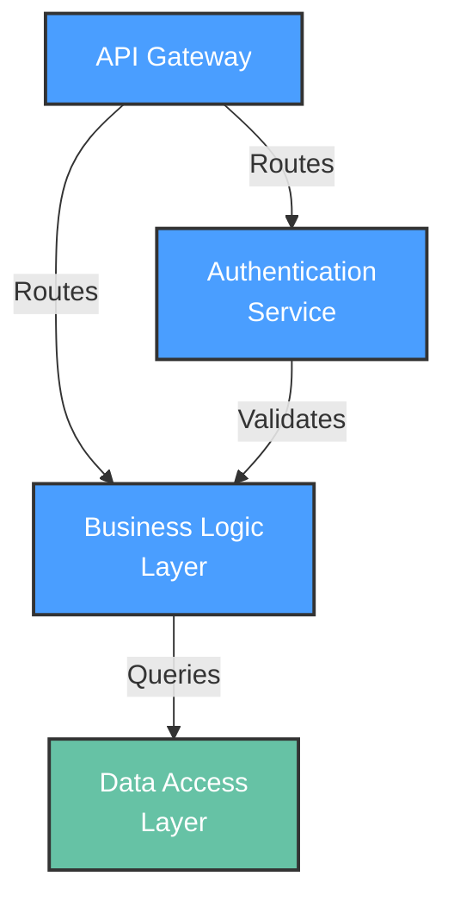

# Functional View: [SUB_SYSTEM_NAME]

**Sub-System**: [SUB_SYSTEM_NAME]
**ADRs Referenced**: [ADR_IDS]
**Generated**: [DATE]
**Dependencies**: Context View

---

## 3.2 Functional View

**Purpose**: Describe functional elements, their responsibilities, and interactions

> **Technology Abstraction Rule**: Elements must be described by **architectural role** (Database, Object Storage, Cache, Message Queue, AI Gateway, Workflow Runtime, App Shell, etc.) — never by product name. This view captures *what* the system does, not *how* it's implemented.
>
> See Development View §3.5.2 for concrete technology choices mapped to these elements.

### 3.2.1 Functional Elements

| Element | Responsibility | Interfaces Provided | Dependencies |
|---------|----------------|---------------------|--------------|
| [COMPONENT_1] | [e.g., User authentication] | [e.g., API /auth/*] | [e.g., Database] |
| [COMPONENT_2] | [Responsibility] | [Interfaces] | [Dependencies] |

### 3.2.2 Element Interactions

### 3.2.3 Functional Boundaries

**What this system DOES:**

- [Functionality 1]
- [Functionality 2]

**What this system does NOT do:**

- [Excluded functionality 1]
- [Excluded functionality 2]

---

## Perspective Considerations

_The following perspectives are applied to this view based on system requirements._

### Security Considerations

[Security concerns specific to this view - e.g., authentication model, authorization patterns, secure component interactions]
[See: templates/perspectives/security.md]

_Source ADRs: [ADR-XXX]_

### Performance Considerations

[Performance concerns specific to this view - e.g., critical paths, component latency budgets, caching opportunities]
[See: templates/perspectives/performance.md]

_Source ADRs: [ADR-XXX]_

### Evolution Considerations

[Evolution concerns - e.g., extension points, plugin architecture, versioning]
[See: templates/perspectives/evolution.md]

_Source ADRs: [ADR-XXX]_

### Usability Considerations

[Usability concerns for user-facing systems - e.g., user workflows, task completion]
[See: templates/perspectives/usability.md]

_Source ADRs: [ADR-XXX]_

---

## Validation Checklist

Before finalizing this view, verify:

- [ ] **Technology Neutrality**: All elements described by architectural role, not product name (Database, not PostgreSQL; Object Storage, not S3)
- [ ] **Diagram Consistency**: Mermaid diagram nodes use generic labels matching the element table
- [ ] **Interface Abstraction**: Interfaces describe capabilities, not implementation protocols
- [ ] **Complete Coverage**: Every major functional responsibility is represented
- [ ] **Clear Boundaries**: "What system DOES" and "does NOT do" are clearly articulated

---

**ADR Traceability:**

| ADR | Decision | Impact on Functional View |
|-----|----------|---------------------------|
| [ADR-XXX] | [Decision] | [How it affects this view] |
