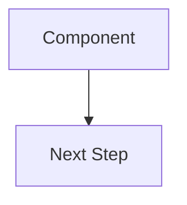
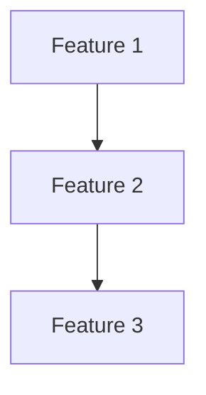

# Product Extension Troubleshooting

This guide helps resolve common issues when using the Product extension v1.5.2+.

---

## Quick Fixes

### Run Validation

Always run validation to check compliance:

```bash
# Check PRD compliance
.specify/extensions/product/scripts/bash/validate-prd.sh PRD.md

# Check with strict mode (exits on warnings)
.specify/extensions/product/scripts/bash/validate-prd.sh PRD.md --strict

# Check PDR completeness
.specify/extensions/product/scripts/bash/validate-pdr.sh .specify/drafts/pdr.md
```

---

## Common Issues

### ❌ Issue: "ASCII Diagrams Found in Main Content"

**Symptom:**
```
✗ FAIL: ASCII box-drawing characters found OUTSIDE <details> blocks
Line: 42: ┌──────────────┐
```

**Cause:**
- Generated content uses ASCII art (box-drawing characters like ┌─┐│)
- Mermaid diagrams not used

**Solution:**

1. **Convert ASCII to Mermaid:**

```markdown
<!-- BEFORE (PROHIBITED) -->
┌──────────────┐
│  Component   │
└──────────────┘
       │
       ▼
┌──────────────┐
│  Next Step   │
└──────────────┘

<!-- AFTER (REQUIRED) -->

```

2. **If ASCII is complex**, keep as fallback in `<details>`:

```markdown
<details>
<summary>📊 ASCII Fallback</summary>

```
[ASCII diagram here]
```

</details>
```

3. **Regenerate with --force:**
```bash
/product.implement --force
```

---

### ❌ Issue: "Visual Summary Not Section 1"

**Symptom:**
```
⚠ WARNING: Section 1 is 'Document Information' - should be 'Visual Summary'
```

**Cause:**
- Generated PRD doesn't follow v1.5.2 section numbering
- Visual Summary exists but is not numbered section 1

**Solution:**

1. **Check current structure:**
```bash
grep "^## " PRD.md | head -5
```

2. **Should show:**
```
## 1. Visual Summary
## 2. Document Information
## 3. Overview
...
```

3. **Fix by regenerating:**
```bash
/product.implement --force
```

4. **Or manually edit PRD.md** to renumber sections

---

### ❌ Issue: "Unfilled Placeholders Found"

**Symptom:**
```
✗ FAIL: Unfilled placeholder: Line 15: [PRODUCT_NAME]
```

**Cause:**
- Template placeholders like `[PRODUCT_NAME]`, `[DATE]` not filled
- Generated content incomplete

**Solution:**

1. **Find all placeholders:**
```bash
grep -E '\[.*\]' PRD.md | grep -E '\[([A-Z_]+|X\.X|Author)\]'
```

2. **Fill each one:**
- `[PRODUCT_NAME]` → Your actual product name
- `[DATE]` → Current date (YYYY-MM-DD)
- `[X.X]` → Version number
- `[Author]` → Your name

3. **Remove template instructions** like "[High-level description...]"

---

### ❌ Issue: "Constitution Contains Template Placeholders"

**Symptom:**
```
⚠ WARNING: Constitution file contains template placeholders
```

**Cause:**
- `.specify/memory/constitution.md` not populated
- Still has `[PROJECT_NAME]`, `[PRINCIPLE_1_NAME]`, etc.

**Solution:**

**Option A: Populate the Constitution**
```bash
# Edit constitution.md and replace all placeholders
vim .specify/memory/constitution.md
```

**Option B: Remove Alignment Claims**
```bash
# Remove or comment out "Constitution Alignment" sections in PDRs
```

---

### ❌ Issue: "No Mermaid Diagrams Found"

**Symptom:**
```
✗ FAIL: No Mermaid diagrams found - MUST have at least 1
```

**Cause:**
- Generated PRD has no Mermaid code blocks
- All diagrams are ASCII or missing

**Solution:**

1. **Check for Mermaid blocks:**
```bash
grep -c "^\`\`\`mermaid" PRD.md
```

2. **Should be ≥2** (recommend: hierarchy, deps, flows)

3. **Add minimum diagrams:**

```markdown
## 1. Visual Summary



See [visuals/feature-hierarchy.md](.specify/product/visuals/feature-hierarchy.md)
```

---

### ❌ Issue: "Requirements Don't Trace to PDRs"

**Symptom:**
```
⚠ WARNING: Only 5/10 requirements have PDR traceability
```

**Cause:**
- Requirements listed but no PDR reference
- Missing traceability table

**Solution:**

1. **Add PDR references to each requirement:**

```markdown
**REQ-001:** User authentication
- Priority: Must
- PDR: PDR-078
```

2. **Or use traceability table:**

```markdown
**Requirements traced to PDRs:**

| Requirement | PDR |
|-------------|-----|
| REQ-001 | PDR-078 |
| REQ-002 | PDR-079 |
```

---

## Workflow Issues

### ❌ Issue: "Cannot proceed: No Accepted PDRs"

**Symptom:**
```
❌ Cannot proceed: No Accepted PDRs found
Current PDRs are: Proposed, Proposed, Discovered
```

**Cause:**
- PDRs exist but none have "Accepted" status
- Must run `/product.clarify` first

**Solution:**

1. **Review and approve PDRs:**
```bash
/product.clarify
```

2. **Change status to "Accepted":**
```markdown
**Status**: Accepted
```

3. **Or force generate** (not recommended):
```bash
/product.implement --force
```

---

### ❌ Issue: "Workflow Validation Failed - clarify_completed = false"

**Symptom:**
```
❌ WORKFLOW VALIDATION FAILED
Current workflow state: clarify_completed = false
```

**Cause:**
- State file shows clarify not completed
- Must run `/product.clarify` before implement

**Solution:**

1. **Complete clarify workflow:**
```bash
/product.clarify
# Approve PDRs when prompted
```

2. **Or bypass with force:**
```bash
/product.implement --force
```

---

## Template Issues

### ❌ Issue: "Section Generated from Scratch (Not Template)"

**Symptom:**
- Section content doesn't match template format
- Missing required subsections
- Different structure than template

**Cause:**
- AI generated content without reading template first
- Template compliance not followed

**Solution:**

1. **Read template first:**
```bash
cat .specify/extensions/product/templates/sections/overview.md
```

2. **Follow exact structure** - don't improvise

3. **Regenerate with strict mode:**
```bash
/product.implement --force
# Follow compliance checklist strictly
```

---

## Validation Exit Codes

| Exit Code | Meaning |
|-----------|---------|
| 0 | All checks passed ✓ |
| 1 | Errors found (strict mode) or validation failed |
| 2 | Warnings only (warn mode) |

---

## Getting Help

### Run Full Diagnostics

```bash
# Check all the things
echo "=== PRD Validation ==="
.specify/extensions/product/scripts/bash/validate-prd.sh PRD.md

echo ""
echo "=== PDR Validation ==="
.specify/extensions/product/scripts/bash/validate-pdr.sh

echo ""
echo "=== File Structure ==="
ls -la .specify/product/sections/*/
ls -la .specify/product/visuals/

echo ""
echo "=== State Check ==="
cat .specify/product/state.json | grep -E "(phase|clarify_completed|implement_completed)"
```

### Check Extension Version

```bash
# Should show v1.5.2+
grep "version:" .specify/extensions/product/commands/implement.md
```

---

## Best Practices

### Before Running `/product.implement`

- [ ] Run `/product.clarify` and approve PDRs
- [ ] Populate constitution.md (or remove alignment claims)
- [ ] Review PDRs for completeness
- [ ] Check for inconsistency flags

### After Generation

- [ ] Run validation script
- [ ] Fix all warnings/errors
- [ ] Verify Mermaid diagrams render
- [ ] Check all placeholders filled
- [ ] Review Visual Summary placement

### Common Regeneration Triggers

Regenerate with `--force` when:
- ASCII diagrams found
- Wrong section numbering
- Missing Visual Summary
- Template not followed
- Major structure changes needed

---

## Version Compatibility

| Extension Version | Key Features |
|-------------------|--------------|
| v1.5.2 | **Current** - Strict compliance, validation scripts, Section 1 Visual Summary |
| v1.5.1 | Mermaid v10 syntax, new diagrams |
| v1.5.0 | Multi-agent DAG, cross-feature-area analysis |

**Upgrade notes:**
- v1.5.2 is backward compatible
- Existing PRDs should be regenerated for full compliance
- Use `--force` flag to regenerate

---

## Still Stuck?

1. **Check the template**: `cat templates/sections/{section}.md`
2. **Run validation**: `./scripts/validate-prd.sh --strict`
3. **Review examples**: See `CNE Agent PRD example` in repo
4. **Check state**: `cat .specify/product/state.json`

---

*Last updated: 2026-05-19 for Extension v1.5.2*
