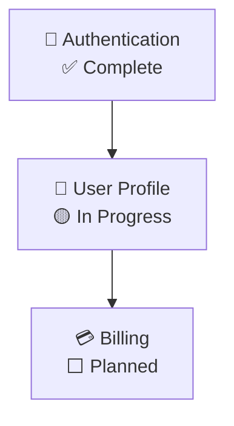
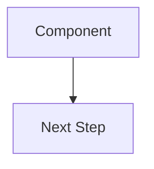

---

## ⚠️ CRITICAL COMPLIANCE CHECKLIST (v1.5.5)

**READ THIS FIRST - MANDATORY REQUIREMENTS**

Before generating ANY content, you MUST verify:

- [ ] **MUST** read and use templates from `templates/sections/{section}.md` - **DO NOT generate from scratch**
- [ ] **MUST** use Mermaid syntax (```mermaid) for ALL diagrams - **ASCII art is STRICTLY PROHIBITED**
- [ ] **MUST** place "Visual Summary" as **Section 1** (numbered) - right after header
- [ ] **MUST** include "Document Information" as **Section 2**
- [ ] **MUST** include "Executive Summary" as **Section 2.5** with business impact metrics
- [ ] **MUST** include "Market Opportunity" as **Section 4.5** with TAM/SAM/SOM
- [ ] **MUST** include "Investment & Resources" as **Section 11.5** with ROI
- [ ] **MUST** include "Go-to-Market Strategy" as **Section 12.5** with pricing
- [ ] **MUST** fill or remove ALL template placeholders like `[PRODUCT_NAME]`, `[DATE]`
- [ ] **MUST** trace all requirements to source PDRs with ID references
- [ ] **MUST** produce a **SELF-CONTAINED** PRD.md - no reader-facing links to `.specify/` files
- [ ] **MUST** validate output with `./scripts/validate-prd.sh --strict` after each section

### STRICT ENFORCEMENT RULES:

1. **Template Usage is MANDATORY**
   - Read the section template FIRST: `cat templates/sections/{section}.md`
   - Fill in the [PLACEHOLDERS] with actual content
   - **NEVER** generate sections from scratch
   - **VIOLATION = Section is INVALID, must regenerate**

2. **Mermaid Diagrams ONLY**
   - Use ` ```mermaid ` code blocks
   - Use `flowchart` keyword (NOT deprecated `graph`)
   - **ASCII box-drawing characters (┌─┐│) are PROHIBITED**
   - **VIOLATION = Convert to Mermaid immediately**

3. **Section Numbering is FIXED**
   - Section 1: Visual Summary (MUST be numbered, inline Mermaid)
   - Section 2: Document Information
   - Section 2.5: Executive Summary (business case, ROI)
   - Section 3: Overview
   - Section 4: The Problem
   - Section 4.5: Market Opportunity (TAM/SAM/SOM, competitive)
   - Section 5-6: Goals, Metrics (+ 6.5 Business Outcome Metrics)
   - Section 7-10: Personas, Requirements, NFRs, Out of Scope
   - Section 11: Risks (+ 11.4 Business Risks)
   - Section 11.5: Investment & Resources (team, budget, ROI)
   - Section 12: Roadmap
   - Section 12.5: Go-to-Market Strategy (launch, pricing, messaging)
   - Section 13: PDR Summary
   - **VIOLATION = Renumber to match template**

4. **Validation is REQUIRED**
   - Run validation script after EACH section
   - Fix ALL errors before marking "completed"
   - **VIOLATION = Do not proceed to next section**

**Failure to comply = Regenerate until compliant**

---

## User Input

```text
$ARGUMENTS
```

You **MUST** consider the user input before proceeding (if not empty).

**Examples of User Input**:

- `"Focus on problem and scope sections - we need clear boundaries"`
- `"Generate full PRD with all sections"`
- `"Update existing PRD.md with new PDRs from recent decisions"`
- `"--no-checkpoint"` - Skip Requirements checkpoint (not recommended)
- Empty input: Generate complete PRD from all PDRs

### Flags

- `--sections SECTIONS`: PRD sections to generate
  - `all` (default): All 15 sections (11 core + 4 business)
  - Custom: comma-separated (e.g., `problem,scope,requirements`)
  - Business sections: `executive-summary,market-opportunity,investment,gtm`

- `--no-checkpoint`: Skip Requirements section checkpoint
  - **Warning**: Requirements is the cornerstone that shapes NFRs, Out-of-Scope, Risks, and Roadmap
  - Not recommended for complex products

- `--force`: Bypass workflow state validation (emergency use only)
  - **WARNING**: May result in processing unapproved PDRs or incomplete architecture

## Goal

Transform Product Decision Records (PDRs) into a comprehensive Product Requirements Document (PRD) using a **multi-agent DAG orchestration** approach:

1. **Plan Agent**: Analyze PDRs, detect feature-areas, generate customized DAG, get user approval
2. **Execute Agent**: Generate sections per feature-area with **mandatory checkpoint after Requirements**
3. **Summarize Agent**: Aggregate all sections, resolve conflicts, generate unified PRD.md

**Key Insight**: PDRs capture **why** decisions were made; the PRD captures **what** the product will deliver. The **Requirements section is the cornerstone** that shapes all subsequent sections.

## Role & Context

You are acting as a **Product Orchestrator** managing a multi-phase documentation generation workflow with strict quality enforcement.

### Why Requirements is the Cornerstone

> "The Requirements section is the cornerstone of most PRDs... It usually drives the shape of other sections such as NFRs, Out-of-Scope, Risks, and Roadmap."

**Requirements** defines:
- What gets built (NFRs, Out-of-Scope boundaries)
- What risks exist (technical feasibility)
- When it gets built (Roadmap prioritization)

**Therefore**: User approval after Requirements is **mandatory** before proceeding.

### Product Document Hierarchy

| Document | Purpose | Location |
|----------|---------|----------|
| `{REPO_ROOT}/.specify/drafts/pdr.md` | Product decisions with rationale | Input |
| `{REPO_ROOT}/.specify/product/state.json` | DAG execution state | State |
| `{REPO_ROOT}/.specify/product/sections/{feature-area}/{section}.md` | Per-section outputs | Intermediate |
| `PRD.md` (root) | Full Product Requirements Document | Output |

## Three-Phase DAG Workflow

```
┌─────────────────────────────────────────────────────────────────┐
│ PHASE 1: PLAN (Plan Agent)                                      │
│ Load PDRs → Detect Feature-Areas → Generate DAG → Approval      │
└─────────────────────────────────────────────────────────────────┘
                              ↓
┌─────────────────────────────────────────────────────────────────┐
│ PHASE 2: EXECUTE (Execute Agent)                                │
│ Per feature-area:                                               │
│   Overview → Problem → Goals → Metrics → Personas               │
│   → [REQUIREMENTS CHECKPOINT] ← MANDATORY USER APPROVAL         │
│   → NFRs → Out-of-Scope → Risks → Roadmap → PDR-Summary         │
└─────────────────────────────────────────────────────────────────┘
                              ↓
┌─────────────────────────────────────────────────────────────────┐
│ PHASE 3: SUMMARIZE (Summarize Agent)                            │
│ Read sections → Detect conflicts → Resolve → PRD.md             │
└─────────────────────────────────────────────────────────────────┘
```

## Pre-Flight Validation (MANDATORY)

**Before starting Phase 1, validate prerequisites:**

### Workflow State Check (unless --force)

1. **Check clarify completion in state.json**:
   - Load `{REPO_ROOT}/.specify/product/state.json`
   - Check `workflow.clarify_completed` field
   - If `false` or missing:
     ```
     ❌ WORKFLOW VALIDATION FAILED
     
     The implement command requires PDRs to be approved via /product.clarify first.
     
     Current workflow state: clarify_completed = false
     
     Required: Run /product.clarify and complete Phase 5.5 (PDR Approval)
     
     Options:
     1. Run /product.clarify to approve PDRs (resolves inconsistency flags)
     2. Use --force to bypass (NOT RECOMMENDED - may process unapproved PDRs)
     ```
     - **HALT execution** (unless `--force` flag provided)

### PDR Status Check

2. **Check PDRs exist**: Verify `{REPO_ROOT}/.specify/drafts/pdr.md` exists
3. **Check for Accepted PDRs**: Count PDRs with status "Accepted"
   - If **zero Accepted PDRs**: **STOP** and output:
     ```
     ❌ Cannot proceed: No Accepted PDRs found
     
     The implement command requires PDRs with "Accepted" status.
     Current PDRs are: [list statuses found]
     
     Run /product.clarify to review and approve PDRs first.
     ```
   - If **≥1 Accepted PDR**: Proceed and report: "✓ Found N Accepted PDRs"

## Mandatory Execution Constraints

> **CRITICAL -- READ THIS BEFORE PROCEEDING**
>
> The following constraints are MANDATORY. Violation invalidates the output.

### Constraint 1: Section Files MUST Be Written to Disk

You **MUST** write each section to disk before proceeding:
- Location: `{REPO_ROOT}/.specify/product/sections/{feature-area}/{section}.md`
- Each file MUST be readable and standalone
- Minimum content: 20 lines with proper section headers

### Constraint 2: State MUST Be Updated After EACH Section

Update state.json after EACH section completion — not at the end.

### Constraint 3: Requirements Checkpoint is MANDATORY

You **MUST** pause after Requirements section for user approval (unless `--no-checkpoint`).

**Checkpoint Options**:
- **A**: Approve - Continue to remaining sections
- **B**: Modify - Edit requirements, then continue
- **C**: Restart - Regenerate from Problem phase
- **D**: Cancel - Stop execution

### Constraint 4: Phase "completed" Requires Verification

Mark phase as "completed" in state.json only after:
- All section files exist on disk
- PRD.md has been written
- Drafts cleanup performed
- Final verification checklist completed

### Constraint 5: PRD.md Content MUST Come From Section Files

Do NOT write PRD.md directly from PDRs. Content MUST come from reading generated section files.

### Constraint 6: Phase 3 MUST Read From Disk

Read section files from disk in Phase 3, not from memory.

## PHASE 1: PLAN (Plan Agent)

**Objective**: Analyze PDRs, detect feature-areas, generate customized DAG

### Step 1.1: Load and Analyze PDRs

1. **Read PDR File**: Load `{REPO_ROOT}/.specify/drafts/pdr.md`
2. **Parse PDR Index**: Extract feature-areas from PDR metadata
3. **Group PDRs by Feature-Area**: Create mapping
4. **Validate PDR Status** (MANDATORY):
   - Count PDRs by status: Accepted / Proposed / Discovered
   - If **zero Accepted PDRs**: **STOP execution**
   - Report: "✓ Found [N] Accepted PDRs ready for implementation"

### Step 1.2: Detect Feature-Areas and Characteristics

For each feature-area, analyze PDRs to detect characteristics:

| Characteristic | Detection Pattern | DAG Customization |
|---------------|-------------------|-------------------|
| B2B SaaS | Enterprise, admin features, SSO | Include compliance sections |
| Consumer App | Mobile, freemium, social | Simplify requirements |
| Platform | API, integrations, developer | Expand NFRs |
| Marketplace | Multi-sided, transaction | Add business model sections |

### Step 1.3: Generate Customized DAG per Feature-Area

**Default DAG (All Sections)**:

```
Overview → Problem → Goals → Metrics → Personas → Requirements
    [CHECKPOINT: User approval required]
    → NFRs → Out-of-Scope → Risks → Roadmap → PDR-Summary
```

**DAG Dependency Rules**:

| Section | Slug | Dependencies | Can Parallelize |
|---------|------|--------------|-----------------|
| Overview | `overview` | None | Yes |
| Problem | `problem` | Overview | Yes |
| Market Opportunity | `market-opportunity` | Overview, Problem | Yes |
| Goals | `goals` | Problem | Yes |
| Metrics | `metrics` | Goals | Yes |
| Personas | `personas` | Problem, Goals | Yes |
| Executive Summary | `executive-summary` | Overview, Problem, Goals, Metrics | Yes |
| **Requirements** | `requirements` | Goals, Personas | **No - CHECKPOINT** |
| NFRs | `nfrs` | Requirements | No |
| Out-of-Scope | `out-of-scope` | Requirements | No |
| Risks | `risks` | Requirements, Out-of-Scope | No |
| Investment | `investment` | Requirements, Risks | No |
| Roadmap | `roadmap` | Requirements, Goals | No |
| Go-to-Market | `gtm` | Roadmap, Personas, Market Opportunity | No |
| PDR-Summary | `pdr-summary` | All above | No |

**Business sections** (marked with sub-numbers 2.5, 4.5, 11.5, 12.5) are generated alongside their adjacent sections. They provide the business context that stakeholders and product managers need for decision-making.

### Step 1.4: Present Plan for User Approval

```markdown
## DAG Execution Plan

**Feature-Areas detected**: 3
**Total sections to generate**: 33 (11 sections × 3 areas)

### Feature-Area: Core
**PDRs**: PDR-001, PDR-005, PDR-008
**Characteristics**: B2B SaaS, Platform
**DAG**: Overview → Problem → Market Opportunity → Goals → Metrics → Personas → Executive Summary → [Requirements Checkpoint] → NFRs → Out-of-Scope → Risks → Investment → Roadmap → GTM → PDR-Summary

**Checkpoint**: After Requirements section, execution will pause for approval.

**Approve this plan?** [Yes/Modify/Cancel]
```

### Step 1.5: Write state.json

After approval, write execution plan to state.

## PHASE 2: EXECUTE (Execute Agent)

**Objective**: Generate sections per feature-area following the DAG

### Section Generation Order

For each section in the DAG:

1. **Check Dependencies**: Ensure all dependencies completed
2. **Load Dependency Context**: Read completed section files
3. **LOAD SECTION TEMPLATE (STRICT - MUST DO)**: 
   - **MUST** read: `cat templates/sections/{section}.md`
   - **MUST** use the template structure exactly as provided
   - **MUST** fill all [PLACEHOLDERS] with actual content
   - **MUST NOT** generate content from scratch
   - **VIOLATION = Section is INVALID**
4. **Generate Section Content**: Fill template with PDR-derived content
5. **Write Section File**: Save to disk
6. **VALIDATE SECTION (STRICT - MUST DO)**:
   - Run: `.specify/extensions/product/scripts/validate-prd.sh {section}.md`
   - Fix ALL errors before proceeding
   - **VIOLATION = Do not mark "completed"**
7. **Update State**: Mark section as "completed" ONLY after validation passes

### Requirements Section Checkpoint (MANDATORY)

**After generating Requirements section**:

```markdown
## 🛑 CHECKPOINT: Requirements Section Complete

The Requirements section has been generated for "{feature-area}".

**Why checkpoint here?** Requirements is the cornerstone that shapes:
- NFRs (how requirements are met)
- Out-of-Scope (what's NOT required)
- Risks (technical feasibility of requirements)
- Roadmap (priority and sequencing)

### Generated Requirements Summary

| ID | Requirement | Priority | PDR Source |
|----|-------------|----------|------------|
| REQ-001 | User authentication | Must have | PDR-002 |
| REQ-002 | Admin dashboard | Should have | PDR-005 |

### Options

**A) Approve** - Continue to NFRs, Out-of-Scope, Risks, Roadmap

**B) Modify** - Edit requirements now, then continue

**C) Restart** - Regenerate from Problem phase

**D) Cancel** - Stop execution

**Your choice?** [A/B/C/D]
```

**If user chooses B (Modify)**:
- Allow editing of requirements
- Re-generate requirements section
- Present checkpoint again

**If user chooses C (Restart)**:
- Reset progress from Problem phase
- Re-generate Problem → Goals → Metrics → Personas → Requirements
- Present checkpoint again

### Step 2.8: Generate Visual Diagrams (MANDATORY)

**MANDATORY: After completing section generation for a feature-area, you MUST create and populate the visuals/ directory.**

Failure to generate visual diagrams results in incomplete PRD documentation. This step is NOT optional.

#### Step 2.8.1: Create visuals/ Directory Structure

Create the following directory structure:
```
{REPO_ROOT}/.specify/product/visuals/
├── feature-hierarchy.md    (MANDATORY)
├── feature-deps.md         (MANDATORY)
├── cross-area-map.md       (if multiple feature-areas)
├── user-flows.md           (if personas defined)
└── state-machine.md        (if stateful features exist)
```

#### Step 2.8.2: Populate Feature Hierarchy

**Source Template**: Copy from `extensions/product/templates/visuals/feature-hierarchy.md`

**Required Replacements**:
- `[PRODUCT_NAME]` → Actual product name from PDR
- Replace all feature node labels with actual features from requirements
- Update completion status based on requirements priority

**Node ID Sanitization Rules**:
1. Remove special characters: `!@#$%^&*()+-=[]{}|;':",./<>?`
2. Replace spaces with underscores: `User Profile` → `User_Profile`
3. Prefix with PDR ID for uniqueness: `Auth_001`, `Billing_002`
4. Keep node labels human-readable in brackets: `Auth_001["🔐 Authentication"]`

**Example Transformation**:


#### Step 2.8.3: Populate Feature Dependencies

**Source Template**: Copy from `extensions/product/templates/visuals/feature-deps.md`

**Required Replacements**:
- List ALL features from Functional Requirements section
- Map dependencies based on requirements traceability
- Use correct status indicators:
  - `✅` Complete (already implemented)
  - `🟡` In Progress (active development)
  - `🔴` Blocked (dependency not met)
  - `⬜` Not Started (planned)

**Edge Styling Rules**:
- `-->` Hard dependency (must complete first)
  - Example: `Auth --> Profile` (cannot profile without auth)
- `-.->` Soft dependency (can proceed in parallel)
  - Example: `Core -.-> Analytics` (analytics can use mocks)
- `-.->|planned|` Future dependency
  - Example: `V1 -.->|planned| V2`

#### Step 2.8.4: Populate Cross-Area Map (Multi-Area Products)

**Source Template**: Copy from `extensions/product/templates/visuals/cross-area-map.md`

**Required Actions**:
1. Create subgraphs for each feature-area
2. Map interactions between areas using actual PDR data
3. Flag inconsistencies using warning callouts:
   ```markdown
   > ⚠️ **Cross-Area Inconsistency**: Core requires real-time updates,
   > but Growth batch analytics may cause delays. Consider event sourcing.
   ```

#### Step 2.8.5: Validate Mermaid Syntax (MANDATORY)

**Before writing files, validate Mermaid syntax:**

1. **Keyword Check**: Verify use of `flowchart` not deprecated `graph`
2. **Node Definition**: Ensure all nodes are defined before referenced
3. **Subgraph Syntax**: Check proper nesting and closing
4. **Class Definitions**: Verify class names match node assignments

**Validation Checklist**:
- [ ] Uses `flowchart TB/LR/TD` (not `graph`)
- [ ] All node IDs are unique
- [ ] All referenced nodes are defined
- [ ] Subgraphs properly closed
- [ ] No trailing spaces after node definitions
- [ ] Arrow syntax correct (`-->`, `-.->`, `==>`)

**If Validation Fails**:
1. Fix syntax errors
2. Generate ASCII fallback in `<details>` block
3. Log error for user review

#### Step 2.8.5b: ASCII to Mermaid Conversion (MANDATORY)

**If PDRs or source content contain ASCII diagrams (box-drawing characters), you MUST convert them to Mermaid:**

**Detection:**
```bash
# Detect ASCII box-drawing characters
grep -P '[\x{2500}-\x{257F}]' content.md
```

**Conversion Process:**
1. **Analyze the ASCII diagram** - Understand what it represents
2. **Choose appropriate Mermaid type:**
   - Flowchart: For processes, architectures, dependencies
   - State diagram: For state machines
   - Journey: For user flows
   - Gantt: For roadmaps/timelines
3. **Create Mermaid equivalent** using proper syntax
4. **Remove or hide ASCII** - Only keep in `<details>` block as fallback

**Example Conversion:**
```markdown
<!-- BEFORE: ASCII (PROHIBITED in main content) -->
┌──────────────┐
│  Component   │
└──────────────┘
       │
       ▼
┌──────────────┐
│  Next Step   │
└──────────────┘

<!-- AFTER: Mermaid (REQUIRED) -->


**IMPORTANT:** ASCII diagrams are **ONLY** allowed in `<details>` blocks as fallbacks, NEVER as primary diagrams.

#### Step 2.8.6: Generate ASCII Fallback (Required for Complex Diagrams)

For diagrams that may fail Mermaid rendering, include ASCII fallback:

```markdown
<details>
<summary>📊 ASCII Fallback</summary>

```
[ASCII art representation]
```

</details>
```

#### Step 2.8.7: Write Files to Disk (MANDATORY)

**Each visual diagram file MUST:**
- Be written to `{REPO_ROOT}/.specify/product/visuals/`
- Contain ≥30 lines
- Include proper frontmatter with generation metadata
- Have working navigation links
- Be standalone readable

**Verification Before Proceeding**:
```bash
# Check files exist and have content
ls -la {REPO_ROOT}/.specify/product/visuals/
wc -l {REPO_ROOT}/.specify/product/visuals/*.md
```

**STOP if files are missing or under 30 lines.**

### Placeholder Validation (MANDATORY)

**Before finalizing any section, validate placeholders:**

| Pattern | Example | Severity | Action |
|---------|---------|----------|--------|
| `[TBD]` | `[TBD]` | CRITICAL | Must be filled |
| `[REQUIREMENT_*]` | `[REQUIREMENT_1]` | CRITICAL | Must be replaced |
| `[PERSONA_*]` | `[PERSONA_1]` | CRITICAL | Must be replaced |
| `[METRIC_*]` | `[METRIC_1]` | HIGH | Should be filled |
| `[DATE]` | `[DATE]` | MEDIUM | Must be replaced |

Sections with unfilled CRITICAL placeholders **CANNOT** be marked "completed".

### Phase 2→3 Gate Verification (MANDATORY)

**Before proceeding to Phase 3, verify:**

1. For each feature-area in state.json, check every section with status "completed"
2. Verify file exists: `{REPO_ROOT}/.specify/product/sections/{feature-area}/{section}.md`
3. Verify each file is readable and has ≥20 lines

**Verification Checklist** (output this table):

| Feature-Area | Section | File Path | Exists | Readable | Lines |
|--------------|---------|-----------|--------|----------|-------|
| {area} | {section} | {path} | ✓/✗ | ✓/✗ | {N} |

**Gate Decision:**
- If **ALL checks pass** → Proceed to Phase 3
- If **ANY check fails** → STOP and report:
  ```
  ❌ PHASE 2→3 GATE BLOCKED
  
  Missing or invalid section files detected:
  - {area}/{section}: [reason]
  
  Regenerate missing sections before proceeding.
  ```

## PHASE 3: SUMMARIZE (Summarize Agent)

**Objective**: Aggregate sections, resolve conflicts, generate PRD.md

### Step 3.1: Read All Section Files FROM DISK (MANDATORY)

> **CRITICAL**: Read each section file from filesystem. Do NOT use content from memory.

1. **Scan Directory**: List `{REPO_ROOT}/.specify/product/sections/`
2. **Read Each File** (MANDATORY):
   - For each feature-area/section in state.json
   - Read: `{REPO_ROOT}/.specify/product/sections/{feature-area}/{section}.md`
   - If cannot read → **STOP** and report error
3. **Validate Content** (MANDATORY):
   - Each file MUST contain ≥20 lines
   - Each section MUST have proper headers

### Step 3.2: Detect Cross-Feature-Area Conflicts

Compare sections across feature-areas:

| Conflict Type | Detection | Resolution |
|--------------|-----------|------------|
| Duplicate requirements | Same requirement, different wording | Standardize to PDR terminology |
| Priority mismatch | Same feature, different priority | Defer to PDR |
| Metric inconsistency | Same metric, different definition | Use PDR definition |

### Step 3.2.5: Embed Visual Summary INLINE (MANDATORY)

**MANDATORY: Section 1 (Visual Summary) must contain ALL diagrams as inline Mermaid blocks.**

> **SELF-CONTAINED RULE (v1.5.3):** The final PRD.md must be readable WITHOUT opening any other file.
> Section files in `.specify/product/sections/` are intermediate build artifacts.
> Visual files in `.specify/product/visuals/` are supplementary only.
> **NO reader-facing links to `.specify/` paths in the final PRD.md.**

#### How to Embed Visuals

1. Extract the Mermaid code blocks from each visual file (`.specify/product/visuals/*.md`)
2. Embed them directly into **Section 1 (Visual Summary)** of PRD.md
3. Use in-document anchor links (e.g., `[Section 1.1](#11-feature-hierarchy)`) for cross-references
4. Do NOT use external file links like `[View](visuals/feature-hierarchy.md)`

#### Section 1 Structure (inline)

```markdown
## 1. Visual Summary

### 1.1 Feature Hierarchy
[Embed Mermaid flowchart from visuals/feature-hierarchy.md]

### 1.2 Feature Dependencies
[Embed Mermaid flowchart from visuals/feature-deps.md]

### 1.3 Roadmap Timeline
[Embed Mermaid gantt from visuals/roadmap-timeline.md]
```

#### Cross-Reference Pattern

When other sections reference visuals, use in-document anchors:
- `See [Section 1.1](#11-feature-hierarchy)` (NOT `[View](visuals/feature-hierarchy.md)`)
- `See [Visual Summary](#1-visual-summary)` (NOT external file links)

### Step 3.2.6: Embed Business Sections (MANDATORY)

**All 4 business sections must be embedded inline in PRD.md:**

1. **Section 2.5 (Executive Summary)**: After Document Info, before Overview
2. **Section 4.5 (Market Opportunity)**: After Problem, before Goals  
3. **Section 11.5 (Investment & Resources)**: After Risks, before Roadmap
4. **Section 12.5 (Go-to-Market Strategy)**: After Roadmap, before PDR Summary

These sections derive content from:
- PDR consequence sections (business impact)
- PDR metrics sections (financial targets)
- Cross-feature-area analysis (market positioning)

### Step 3.2.7: ASCII Fallback Diagrams (Complex Only)

If Mermaid rendering fails, ASCII diagrams are available in the full visual files linked above.
```

#### Embedding Rules (v1.5.3 — Self-Contained)

1. **Extract Mermaid Blocks**: Copy the mermaid code block from each visual file into Section 1 of PRD.md
2. **Preserve Node IDs**: Do NOT modify node IDs (already sanitized in Step 2.8)
3. **Use In-Document Anchors**: All cross-references use `[Section 1.1](#11-feature-hierarchy)` format — **NO external file links**
4. **No External Navigation**: Do NOT link to visual files or section files — everything is inline
5. **ASCII Fallback Inline**: If needed, include ASCII fallback in `<details>` blocks **within PRD.md itself** — do NOT reference external source files

#### Verification Checklist

- [ ] Visual Summary (Section 1) contains inline Mermaid diagrams
- [ ] All diagram types embedded (hierarchy, deps, roadmap gantt)
- [ ] Mermaid blocks are complete and valid
- [ ] **ZERO** `.specify/` paths in reader-facing content
- [ ] All cross-references use in-document anchors (`#section-id`)

### Step 3.3: Aggregate into Unified PRD.md

> **CRITICAL (v1.5.3): The PRD.md MUST be SELF-CONTAINED.**
> - ALL Mermaid diagrams embedded inline in Section 1 (Visual Summary)
> - ALL business sections (2.5, 4.5, 6.5, 11.4, 11.5, 12.5) included
> - **ZERO reader-facing links to `.specify/` paths** — use in-document anchors only
> - Section files and visual files are build artifacts only — do NOT reference them

**Structure** (must match `prd-template.md` exactly):

```markdown
# Product Requirements Document: [Product Name]

## 1. Visual Summary
[Inline Mermaid diagrams: feature hierarchy, dependencies, roadmap gantt]
[Quick Stats table: version, status, PDR count, requirements count]

## 2. Document Information
[Revision history, related documents (NO clickable .specify/ links), approval table]

## 2.5 Executive Summary
[One-page business case: opportunity, problem, solution, business impact, investment, ROI, recommendation]

## 3. Overview
[Product description, purpose, scope, architecture (inline Mermaid)]

## 4. The Problem
[Problem statement, context, validation evidence]

## 4.5 Market Opportunity
[TAM/SAM/SOM, competitive landscape, market timing, ICP, positioning]

## 5. Goals & Objectives
[Primary, technical, and business goals traced to PDRs]

## 6. Success Metrics
[Adoption, engagement, quality metrics]

### 6.5 Business Outcome Metrics
[Efficiency, quality, time metrics with $ values]

### 6.6 Financial Metrics
[Cost per user, ROI, payback period]

## 7. Personas
[Primary and secondary personas, anti-personas]

## 8. Functional Requirements [CHECKPOINT]
[User stories, feature requirements with REQ-XXX IDs, priority matrix, dependency diagram (inline Mermaid)]

## 9. Non-Functional Requirements
[Performance, security, reliability, usability, scalability]

## 10. Out of Scope
[Feature, technical, market exclusions with rationale]

## 11. Risks & Mitigation
[Risk summary table, technical risks, market risks]

### 11.4 Business Risks
[Adoption, competitive, financial risks]

## 11.5 Investment & Resources
[Team composition, budget estimate, risk-adjusted ROI, go/no-go criteria]

## 12. Roadmap & Milestones
[Gantt chart (inline Mermaid), milestone details with demo sentences]

## 12.5 Go-to-Market Strategy
[Launch phases, pricing tiers, key messaging, success metrics by phase]

## 13. PDR Summary
[Key decisions table, constitution alignment — NO external links]

## Appendix A: Glossary
## Appendix B: References
## Appendix C: Change History
```

**Self-Contained Cross-Reference Rules:**
- Visual references: `See [Section 1.1](#11-feature-hierarchy)` (NOT `[View](visuals/...)`)
- PDR references: `PDR-078` as text (NOT `[PDR-078](.specify/drafts/pdr.md#pdr-078)`)
- Constitution references: "as defined in the project constitution" (NOT `[constitution](.specify/memory/constitution.md)`)
- Section cross-refs: `See [Section 8](#8-functional-requirements)` (in-document anchors only)

### Step 3.4: PDR Lifecycle Management (MANDATORY — DO NOT SKIP)

> **⚠️ THIS STEP IS MANDATORY.** The implement command CANNOT be marked "completed" without executing PDR lifecycle management. Skipping this step means the Final Completion Verification (checks 5 and 6) will FAIL, and `state.json` phase MUST NOT be set to "completed".

**Step 1: Filter Accepted PDRs**
- Read `{REPO_ROOT}/.specify/drafts/pdr.md`
- Count PDRs with status "Accepted"
- Count PDRs with status "Proposed" or "Discovered"

**Step 2: Copy Accepted PDRs to Memory (MANDATORY)**
- Write Accepted PDRs to `{REPO_ROOT}/.specify/memory/pdr.md`
- If `memory/pdr.md` already exists, merge (append new PDRs, update existing)
- **Verify file was written**: `ls -la {REPO_ROOT}/.specify/memory/pdr.md`
- **If write fails → STOP and report error**

**Step 3: Clean Up Drafts**
- If ALL PDRs are Accepted → drafts file may be retained for cross-reference analysis
- If some PDRs remain Proposed/Discovered → keep only those in drafts
- Set `pdr_lifecycle.drafts_retained` and `pdr_lifecycle.drafts_reason` in state.json

**Step 4: Update state.json with Lifecycle Fields**
```json
"pdr_lifecycle": {
  "pdrs_promoted": [N],
  "memory_pdr_written": true,
  "memory_pdr_location": ".specify/memory/pdr.md",
  "drafts_retained": true|false,
  "drafts_reason": "[reason if retained]"
}
```

**Step 5: Report Lifecycle Changes**
```
📋 PDR Lifecycle Summary:
├── Promoted to memory: [N] Accepted PDRs
├── Memory file: .specify/memory/pdr.md ✓
├── Remaining in drafts: [M] PDRs (Proposed/Discovered)
└── Cleanup verified: ✓
```

**Failure Mode**: If Step 2 (copy to memory) is not executed, the Final Completion Verification checks 5 and 6 will fail, blocking the "completed" state.

### Step 3.5: Generate Final Report

```markdown
## PRD Generation Complete ✓

**Output**: PRD.md (project root)
**Sections Mode**: [all|custom]
**Feature-Areas Processed**: N

### Execution Summary
| Phase | Status |
|-------|--------|
| Plan | ✓ Approved |
| Execute | ✓ Completed (with checkpoint) |
| Summarize | ✓ Completed |

### Sections Generated
| Feature-Area | Sections | Status |
|--------------|----------|--------|
| Core | 11/11 | ✓ |
| Business | 11/11 | ✓ |

### Conflicts Resolved
| Type | Count |
|------|-------|
| Duplicate requirements | 2 |
| Priority mismatches | 1 |

### PDR Lifecycle
- Promoted to canonical: N PDRs
- Remaining in drafts: M PDRs

### Next Steps
1. Review PRD.md for accuracy
2. Run `/product.analyze` for validation
3. Share with stakeholders
4. Begin feature development with `/spec.specify`
```

## Final Completion Verification (MANDATORY — ALL CHECKS MUST PASS)

> **⚠️ DO NOT set `phase: "completed"` until ALL checks pass.** This is a hard gate.

**Before marking state.json phase as "completed", verify:**

| # | Check | Expected | Verification | Status |
|---|-------|----------|--------------|--------|
| 1 | Section files on disk | N files | `ls .specify/product/sections/` | ☐ |
| 2 | PRD.md exists | Yes | `ls PRD.md` | ☐ |
| 3 | PRD.md content size | >200 lines | `wc -l PRD.md` | ☐ |
| 4 | PRD.md has all sections | Sections 1-13 + sub-sections | `grep "^## " PRD.md` | ☐ |
| 5 | PRD.md is self-contained | 0 `.specify/` links | `grep -c '](.specify/' PRD.md` = 0 | ☐ |
| 6 | **Memory PDRs written** | `memory/pdr.md` exists | `ls .specify/memory/pdr.md` | ☐ |
| 7 | **`pdr_lifecycle.memory_pdr_written`** | `true` | Check state.json | ☐ |
| 8 | Drafts status documented | `pdr_lifecycle` in state.json | Check state.json has `pdr_lifecycle` object | ☐ |
| 9 | state.json consistent | All sections "completed" | Verify progress | ☐ |

**Gate Rule:**
- If **ALL 9 checks pass**: Mark `phase: "completed"` and `pdr_lifecycle.memory_pdr_written: true`
- If **ANY check fails**: Do NOT mark as completed. Report which check(s) failed.
- **Check 6 is the most commonly skipped** — verify `memory/pdr.md` actually exists on disk.

## State File Schema

**Location**: `{REPO_ROOT}/.specify/product/state.json`

```json
{
  "version": "1.2.0",
  "created_at": "ISO8601 timestamp",
  "updated_at": "ISO8601 timestamp",
  "phase": "planning | plan_approved | executing | summarizing | completed",
  "sections_mode": "all | custom",
  "checkpoint": {
    "enabled": true,
    "after_section": "requirements",
    "status": "pending | approved | modified | restarted"
  },
  "feature_areas": [
    {
      "id": "core",
      "name": "Core",
      "pdrs": ["PDR-001"],
      "characteristics": ["b2b", "saas"],
      "dag": ["overview", "problem", "market-opportunity", "goals", "metrics", "personas", "executive-summary", "requirements", "nfrs", "out-of-scope", "risks", "investment", "roadmap", "gtm", "pdr-summary"],
      "progress": {
        "overview": "completed",
        "problem": "completed",
        "requirements": "completed",
        "checkpoint_status": "approved"
      }
    }
  ],
  "pdr_lifecycle": {
    "pdrs_promoted": 0,
    "memory_pdr_written": false,
    "memory_pdr_location": ".specify/memory/pdr.md",
    "drafts_retained": false,
    "drafts_reason": ""
  },
  "conflicts_detected": [],
  "conflicts_resolved": [],
  "output_file": "PRD.md"
}
```

> **IMPORTANT**: The `pdr_lifecycle` object is MANDATORY. The Final Completion Verification checks `memory_pdr_written === true` before allowing phase "completed". If this field is `false`, the gate MUST fail.

## Key Rules

### PDR Traceability
- **Every section** must reference source PDRs
- **No content** without PDR backing
- **PDRs are source of truth** for conflict resolution

### State Persistence
- **Always update** state.json after each operation
- **Resume gracefully** from any interruption
- **Track progress** at section granularity

### Quality Standards
- **Validate** requirements are actionable
- **Ensure** acceptance criteria are testable
- **Check** metric definitions are measurable
- **Verify** placeholder validation passes

## Workflow Guidance

### After `/product.implement`

1. **Review PRD**: Verify documentation is accurate
2. **Run `/product.analyze`**: Validate consistency
3. **Share for Review**: Get stakeholder feedback
4. **Start Features**: Use `/spec.specify` to create feature specs

### When to Use This Command

- **After `/product.clarify`**: Generate PRD from validated PDRs
- **After `/product.init`**: Document existing product
- **PDR Updates**: Regenerate after new decisions

### When NOT to Use This Command

- **No Accepted PDRs**: Run `/product.clarify` first
- **Feature-level**: Use `/spec.plan --product`
- **Minor updates**: Edit PRD.md directly

## Context

{ARGS}
