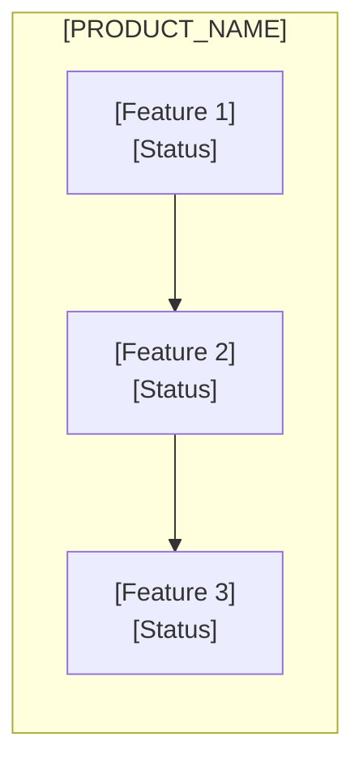
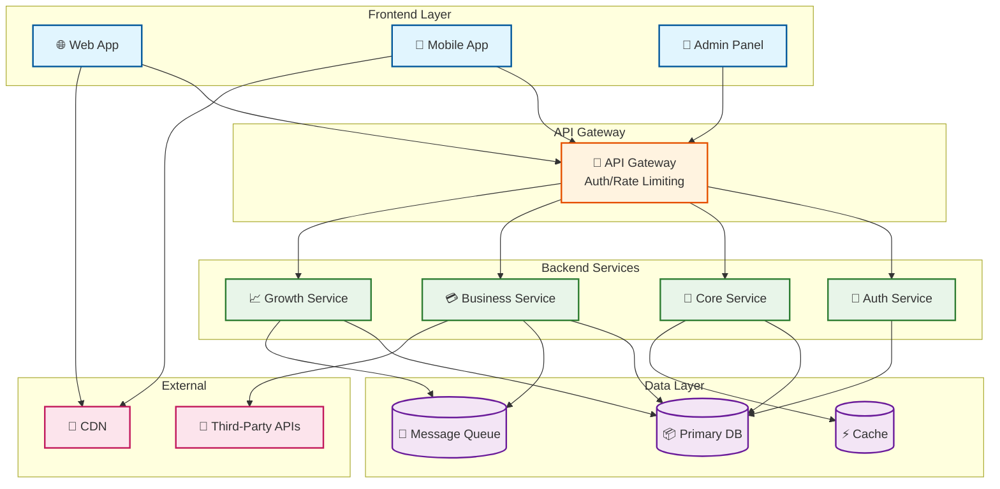
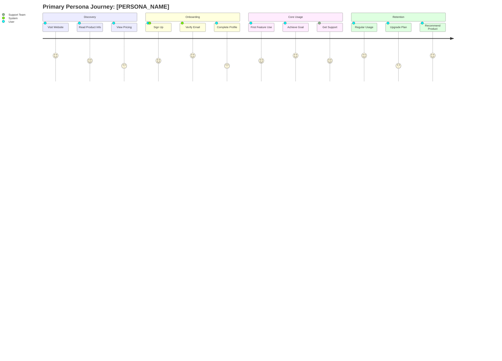
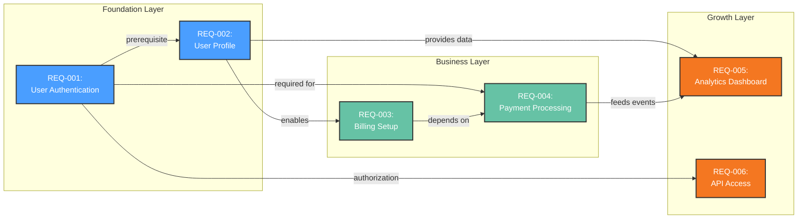
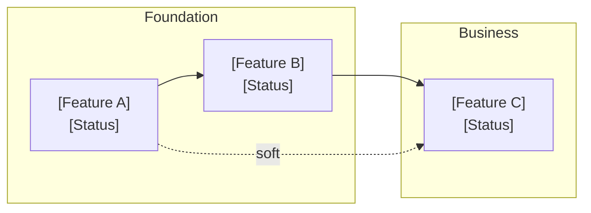

<!-- 
TEMPLATE COMPLIANCE REQUIREMENTS (v1.5.6):
- MUST use Mermaid diagrams (```mermaid) - NOT ASCII art
- MUST fill ALL [PLACEHOLDERS] with actual content
- MUST use this exact section structure (1-12, with sub-sections 1.5, 3.5, 5.5, 10.5, 11.5)
- MUST trace all requirements to PDRs
- MUST embed ALL content inline - PRD.md must be self-contained (no reader-facing external links)
- MUST embed Mermaid diagrams IN-SECTION (near the content they describe)
- MUST run validation: ./scripts/validate-prd.sh --strict
VIOLATION = Non-compliant PRD

SELF-CONTAINED RULE: The final PRD.md must be readable without opening any other file.
Section files in .specify/product/sections/ are intermediate build artifacts only.
Diagrams are embedded inline within their relevant sections — NOT in a separate Visual Summary.
-->

# Product Requirements Document: [PRODUCT_NAME]

---

## 1. Document Information

### Quick Stats

| Metric | Value |
|--------|-------|
| **Version** | [X.X] |
| **Status** | Draft \| Review \| Approved |
| **Source PDRs** | [N] Product Decision Records |
| **Requirements** | [N] Must / [N] Should / [N] Could |
| **Last Updated** | [YYYY-MM-DD] |

### 1.1 Revision History

| Version | Date | Author | Changes |
|---------|------|--------|---------|
| [X.X] | [YYYY-MM-DD] | [Author] | [Description of changes] |

### 1.2 Related Documents

| Document | Description |
|----------|-------------|
| Product Decision Records | Source PDRs with decision rationale (see [Section 12](#12-pdr-summary)) |
| Architecture Description | System architecture and ADRs |
| Constitution | Project principles and constraints |

### 1.3 Approval

| Role | Name | Date | Signature |
|------|------|------|-----------|
| Product Owner | [Name] | [Date] | [✓] |
| Tech Lead | [Name] | [Date] | [✓] |
| Stakeholder | [Name] | [Date] | [✓] |

---

## 1.5 Executive Summary

> **For executive decision-makers.** This section summarizes the business case in 60 seconds.

### The Opportunity

[1-2 sentences: What market opportunity does this product address?]

### The Problem (Business Impact)

- [Pain point 1 with quantified business impact]
- [Pain point 2 with quantified business impact]
- [Pain point 3 with quantified business impact]

### The Solution

[2-3 sentences: What the product delivers. Focus on business outcomes.]

### Business Impact

| Metric | Current State | Target (12 months) | Value |
|--------|--------------|-------------------|-------|
| [Efficiency metric] | [Baseline] | [Target] | [$ value] |
| [Quality metric] | [Baseline] | [Target] | [% value] |
| [Adoption metric] | [Baseline] | [Target] | [Multiplier] |

### Investment & ROI

| | Amount |
|---|--------|
| **Annual Investment** | $[N] |
| **Expected ROI (12-month)** | [N]% |
| **Payback Period** | [N] months |

### Recommendation

**[APPROVE / CONDITIONAL / DEFER]** - [1-2 sentence justification]

---

## 2. Overview

[High-level description of the product - what it is and why it exists]

[Derived from Problem PDRs and Vision/Constitution]

### 2.1 Product Description

[2-3 sentences describing the product's core purpose and value proposition]

**Key Differentiators:**
- [Differentiator 1]
- [Differentiator 2]
- [Differentiator 3]

### 2.2 Purpose

[Describe the business/technical problem this product solves]

**Target Outcome:** [What success looks like]

### 2.3 Scope

**In Scope:**

- [Core capability 1]
- [Core capability 2]
- [Core capability 3]

**Out of Scope:**

- [Explicitly excluded capability 1 - with rationale]
- [Explicitly excluded capability 2 - with rationale]

### 2.4 Feature Hierarchy



### 2.5 Architecture Overview



**Architecture Notes**:
- Frontend layer serves multiple client types
- API Gateway handles cross-cutting concerns
- Backend services are organized by feature area
- Data layer provides persistence and messaging
- External integrations are abstracted behind service layer

**PDR Traceability:**

| PDR | Category | Impact on Overview |
|-----|----------|-------------------|
| [PDR-XXX] | Problem | [How it affects this section] |
| [PDR-XXX] | Business Model | [How it affects this section] |

---

## 3. The Problem

[Problem statement - what pain point or opportunity this product addresses]

**Problem Context:**

- [Current state description - what exists today]
- [Pain points experienced by users - be specific]
- [Impact of not solving this problem - quantitative if possible]

### 3.1 Evidence

> "[Direct quote from user research or market analysis]"
> — [Source]

[Supporting data: user research, market analysis, competitive analysis]

### 3.2 Stakeholder Impact

| Stakeholder | Current Pain | Desired State |
|-------------|--------------|---------------|
| [Persona 1] | [Pain point] | [Ideal outcome] |
| [Persona 2] | [Pain point] | [Ideal outcome] |

**Derived from:** PDR-XXX (Problem category)

---

## 3.5 Market Opportunity

### 3.5.1 Market Size

| Segment | Size | Description |
|---------|------|-------------|
| **TAM** | $[N]B | [Total addressable market] |
| **SAM** | $[N]B | [Serviceable addressable market] |
| **SOM** | $[N]M | [Serviceable obtainable market - year 1-2 target] |

### 3.5.2 Competitive Landscape

| Competitor | Approach | Strength | Our Differentiation |
|------------|----------|----------|---------------------|
| [Competitor 1] | [Approach] | [Strength] | [How we differ] |
| [Competitor 2] | [Approach] | [Strength] | [How we differ] |

### 3.5.3 Market Timing

| Timeframe | Signal | Implication |
|-----------|--------|-------------|
| **Now** | [Current state] | [Why act now] |
| **6 months** | [Trend] | [Opportunity/risk] |
| **12 months** | [Trend] | [Expected shift] |

### 3.5.4 Target Customers (ICP)

**Primary:** [Role] at [Company type]
- **Pain:** [What drives the purchase]
- **Budget:** $[Range]/year
- **Decision Cycle:** [Timeline]

### 3.5.5 Positioning Statement

**For** [target customer] **who** [need], **[product]** is a [category] **that** [key benefit]. **Unlike** [competitor], **our product** [differentiation].

---

## 4. Goals & Objectives

### 4.1 Primary Goal

**[Main product objective - what success looks like]**

[Detailed description of the primary goal with measurable outcomes]

### 4.2 Technical Goals

- **[Goal 1]:** [Technical outcome required]
  - Target: [Metric]
  - Measurement: [How measured]
  
- **[Goal 2]:** [Technical outcome required]
  - Target: [Metric]
  - Measurement: [How measured]

### 4.3 Business Goals

- **[Goal 1]:** [Business value delivered]
  - Target: [Metric]
  - Measurement: [How measured]

**Goals traced to PDRs:**

| Goal | PDR | Category | Target |
|------|-----|----------|--------|
| [Goal] | PDR-XXX | [Category] | [Target] |

---

## 5. Success Metrics

### 5.1 Adoption Metrics

| Metric | Target | Timeframe | Measurement Method |
|--------|--------|-----------|-------------------|
| [Metric 1] | [Target] | [Timeframe] | [Method] |
| [Metric 2] | [Target] | [Timeframe] | [Method] |

### 5.2 Engagement Metrics

| Metric | Target | Timeframe | Measurement Method |
|--------|--------|-----------|-------------------|
| [Metric 1] | [Target] | [Timeframe] | [Method] |

### 5.3 Quality Metrics

| Metric | Target | Timeframe | Measurement Method |
|--------|--------|-----------|-------------------|
| [Metric 1] | [Target] | [Timeframe] | [Method] |

**Metrics traced to PDRs:**

| Metric | Target | PDR |
|--------|--------|-----|
| [Metric] | [Target] | PDR-XXX |

### 5.5 Business Outcome Metrics

| Metric | Target | Business Impact | Measurement |
|--------|--------|-----------------|-------------|
| [Efficiency metric] | [Target] | $[Value]/year | [How measured] |
| [Quality metric] | [Target] | [% reduction] in [cost] | [How measured] |
| [Time metric] | [Target] | [% improvement] | [How measured] |

### 5.6 Financial Metrics

| Metric | Target | Measurement |
|--------|--------|-------------|
| **Cost per User** | <$[N]/month | Total cost / active users |
| **ROI** | >[N]% (12-month) | (Value delivered - Cost) / Cost |
| **Payback Period** | <[N] months | Time to positive ROI |

---

## 6. Personas

### 6.1 Primary Persona: [Persona Name]

**Role:** [Job title/function]

**Demographics:**
- [Age range, experience level, etc.]

**Goals:**
- [Goal 1]
- [Goal 2]

**Needs:**
- [What they need from this product]

**Pain Points:**
- [Current pain point 1]
- [Current pain point 2]

**Success Quote:** 
> "[How they describe success]"

**PDR Reference:** PDR-XXX

### 6.2 Secondary Persona: [Persona Name]

**Role:** [Job title/function]

**Goals:**
- [Goal 1]

**Needs:**
- [What they need from this product]

**Success Quote:** 
> "[How they describe success]"

**PDR Reference:** PDR-XXX

### 6.3 Anti-Personas (Who This Is NOT For)

| Anti-Persona | Why Not Targeted |
|--------------|------------------|
| [Role/Type] | [Reason for exclusion] |

### 6.4 User Journey



---

## 7. Functional Requirements

### 7.1 User Stories

| ID | Story | Persona | Priority | PDR |
|----|-------|---------|----------|-----|
| US-001 | As a [persona], I want to [action] so that [benefit] | [Persona] | Must | PDR-XXX |
| US-002 | As a [persona], I want to [action] so that [benefit] | [Persona] | Should | PDR-XXX |
| US-003 | As a [persona], I want to [action] so that [benefit] | [Persona] | Could | PDR-XXX |

### 7.2 Feature Requirements

#### Feature 1: [Feature Name]

**Description:** [What the feature does]

**User Story:** US-XXX

**Requirements:**

- **REQ-001:** [Specific requirement]
  - Priority: Must
  - PDR: PDR-XXX
  
- **REQ-002:** [Specific requirement]
  - Priority: Must
  - PDR: PDR-XXX

**Acceptance Criteria:**

- [ ] [Criterion 1 - testable, specific]
- [ ] [Criterion 2 - testable, specific]
- [ ] [Criterion 3 - testable, specific]

**Traced to:** PDR-XXX (Scope/Feature category)

#### Feature 2: [Feature Name]

**Description:** [What the feature does]

**Requirements:**

- **REQ-003:** [Specific requirement]
- **REQ-004:** [Specific requirement]

**Acceptance Criteria:**

- [ ] [Criterion 1]
- [ ] [Criterion 2]

**Traced to:** PDR-XXX (Scope/Feature category)

### 7.3 Requirements Priority Matrix

| Priority | Count | Description |
|----------|-------|-------------|
| Must | [N] | Critical for launch - product is incomplete without these |
| Should | [N] | Important but not blocking - can ship without |
| Could | [N] | Nice to have - add if time permits |
| Won't | [N] | Explicitly excluded - documented in Out of Scope |

**Total:** [N] requirements

### 7.4 Requirement Dependencies



**Dependency Notes**:
- Foundation layer requirements must be completed first
- Business layer builds on foundation
- Growth layer features can proceed in parallel after foundation
- Critical path: REQ-001 -> REQ-002 -> REQ-003 -> REQ-004

### 7.5 Feature Dependencies



**PDR Traceability:**

| PDR | Decision | Impact on Requirements |
|-----|----------|------------------------|
| [PDR-XXX] | [Decision] | [How it defines requirements] |

---

## 8. Non-Functional Requirements (NFRs)

### 8.1 Performance

| Requirement | Target | Measurement | PDR |
|-------------|--------|-------------|-----|
| [Requirement 1] | [Target] | [Method] | PDR-XXX |
| [Requirement 2] | [Target] | [Method] | PDR-XXX |

### 8.2 Security

| Requirement | Target | Measurement | PDR |
|-------------|--------|-------------|-----|
| [Requirement 1] | [Target] | [Method] | PDR-XXX |

### 8.3 Reliability

| Requirement | Target | Measurement | PDR |
|-------------|--------|-------------|-----|
| [Requirement 1] | [Target] | [Method] | PDR-XXX |

### 8.4 Usability

| Requirement | Target | Measurement | PDR |
|-------------|--------|-------------|-----|
| [Requirement 1] | [Target] | [Method] | PDR-XXX |

### 8.5 Scalability

| Requirement | Target | Measurement | PDR |
|-------------|--------|-------------|-----|
| [Requirement 1] | [Target] | [Method] | PDR-XXX |

**NFRs traced to PDRs:**

| NFR | Requirement | PDR |
|-----|--------------|-----|
| [Type] | [Requirement] | PDR-XXX |

---

## 9. Out of Scope

### 9.1 Features

- **[Feature 1]:** [Explicitly excluded feature with rationale]
  - **Rationale:** [Why excluded]
  - **Future Consideration:** [When/if it might be added]
  
- **[Feature 2]:** [Explicitly excluded feature with rationale]
  - **Rationale:** [Why excluded]

### 9.2 Technical

- **[Technical exclusion 1]:** [What is excluded]
  - **Rationale:** [Why excluded]

### 9.3 Markets

- **[Market exclusion 1]:** [Which markets/users are not targeted]
  - **Rationale:** [Why excluded]

**Scope decisions traced to PDRs:**

| Out of Scope | PDR | Rationale |
|--------------|-----|-----------|
| [Item] | PDR-XXX | [Why excluded] |

---

## 10. Risks & Mitigation

| Risk | Likelihood | Impact | Mitigation Strategy | PDR |
|------|------------|--------|---------------------|-----|
| [Risk description] | H/M/L | H/M/L | [Mitigation approach] | PDR-XXX |

### 10.1 Technical Risks

- **[Risk 1]:** [Technical risk description]
  - **Mitigation:** [How to mitigate]

### 10.2 Market Risks

- **[Risk 1]:** [Market risk description]
  - **Mitigation:** [How to mitigate]

### 10.3 Operational Risks

- **[Risk 1]:** [Operational risk description]
  - **Mitigation:** [How to mitigate]

### 10.4 Business Risks

| Risk | Likelihood | Impact | Mitigation | PDR |
|------|------------|--------|------------|-----|
| [Adoption risk] | H/M/L | H/M/L | [Mitigation] | PDR-XXX |
| [Competitive risk] | H/M/L | H/M/L | [Mitigation] | PDR-XXX |
| [Financial risk] | H/M/L | H/M/L | [Mitigation] | PDR-XXX |

*Risks traced to PDR consequence sections*

---

## 10.5 Investment & Resources

### Team Composition

| Role | FTEs | Phase | Responsibility |
|------|------|-------|----------------|
| [Role 1] | [N] | [Phase] | [Responsibility] |
| [Role 2] | [N] | [Phase] | [Responsibility] |

**Total:** [N] FTEs average, [N] FTEs peak

### Budget Estimate

| Category | Phase 1 | Phase 2 | Phase 3 | Annual |
|----------|---------|---------|---------|--------|
| **Personnel** | $[N]K | $[N]K | $[N]K | $[N]M |
| **Infrastructure** | $[N]K | $[N]K | $[N]K | $[N]K |
| **Total** | **$[N]K** | **$[N]K** | **$[N]K** | **$[N]M** |

### Risk-Adjusted ROI

| Scenario | Probability | 12-Month ROI | NPV (3-year) |
|----------|-------------|--------------|--------------|
| Optimistic | [N]% | [N]% | $[N]M |
| Base Case | [N]% | [N]% | $[N]M |
| Pessimistic | [N]% | [N]% | $[N]M |
| **Weighted** | 100% | **[N]%** | **$[N]M** |

### Go/No-Go Criteria

| Checkpoint | Date | Criteria | Decision |
|------------|------|----------|----------|
| Phase 1 Review | [Date] | [What must be true] | Go / No-Go |
| Phase 2 Review | [Date] | [What must be true] | Go / No-Go |

---

## 11. Roadmap & Milestones

### 11.1 Roadmap Overview

```mermaid
gantt
    title [PRODUCT_NAME] Roadmap
    dateFormat YYYY-MM-DD
    axisFormat %b %Y
    
    section [Phase 1]
    [Feature] :done, f1, [START], [DURATION]
    [Feature] :done, f2, after f1, [DURATION]
    
    section [Phase 2]
    [Feature] :f3, after f2, [DURATION]
    [Feature] :f4, after f3, [DURATION]
    
    section Milestones
    [Milestone 1] :milestone, m1, [DATE], 0d
    [Milestone 2] :milestone, m2, [DATE], 0d
```

> **Sync with external tools**: Run `/product.roadmap --sync` to pull milestones from GitHub/GitLab/Jira/Linear

<!-- Generated from Milestone PDRs -->

### 11.2 Milestone 1: [Name] - [Target Date]

**Demo Sentence:** "After this milestone, the user can: [observable capability]"

**Status:** Planned | In Progress | Complete

**Release Goal:** [What this milestone achieves]

| Feature | Priority | Demo Sentence | Dependencies |
|---------|----------|---------------|--------------|
| [Feature spec name] | Must | "user can ___" | None (leaf) |
| [Feature spec name] | Must | "user can ___" | Depends on [Feature] |
| [Feature spec name] | Should | "user can ___" | Depends on [Feature], [Feature] |

**Success Criteria:**

| Metric | Target | Measurement |
|--------|--------|-------------|
| [Metric] | [Target] | [Method] |

### 11.3 Milestone 2: [Name] - [Target Date]

**Demo Sentence:** "After this milestone, the user can: [observable capability]"

**Status:** Planned | In Progress | Complete

**Release Goal:** [What this milestone achieves]

| Feature | Priority | Demo Sentence | Dependencies |
|---------|----------|---------------|--------------|
| [Feature spec name] | Must | "user can ___" | None (leaf) |
| [Feature spec name] | Should | "user can ___" | Depends on [Feature] |

**Features Deferred from Previous:**

- [Feature] - deferred to this milestone

### 11.4 Milestone 3: [Name] - [Target Date]

**Demo Sentence:** "After this milestone, the user can: [observable capability]"

**Status:** Planned | In Progress | Complete

**Release Goal:** [What this milestone achieves]

| Feature | Priority | Demo Sentence | Dependencies |
|---------|----------|---------------|--------------|
| [Feature spec name] | Must | "user can ___" | None (leaf) |

**Milestones traced to PDRs:**

| Milestone | PDR | Target Date |
|-----------|-----|--------------|
| Milestone 1 | PDR-XXX | [Date] |
| Milestone 2 | PDR-XXX | [Date] |
| Milestone 3 | PDR-XXX | [Date] |

---

## 11.5 Go-to-Market Strategy

### 11.5.1 Launch Phases

| Phase | Timeline | Audience | Goal | Success Metric |
|-------|----------|----------|------|----------------|
| [Phase 1] | [Date] | [Who] | [Goal] | [Metric] |
| [Phase 2] | [Date] | [Who] | [Goal] | [Metric] |
| [Phase 3] | [Date] | [Who] | [Goal] | [Metric] |
| [GA] | [Date] | [Public] | [Revenue target] | [Metric] |

### 11.5.2 Pricing Strategy

| Tier | Price | Includes | Target |
|------|-------|----------|--------|
| **Free** | $0 | [What's included] | [Who] |
| **[Paid]** | $[N]/[unit]/[period] | [What's included] | [Who] |
| **Enterprise** | Custom | [What's included] | [Who] |

### 11.5.3 Key Messaging

| Audience | Message |
|----------|---------|
| **Executives** | "[Value prop for C-level]" |
| **Engineering Leaders** | "[Value prop for eng managers]" |
| **Developers** | "[Value prop for ICs]" |

### 11.5.4 Success Metrics by Phase

| Phase | Adoption | Engagement | Revenue |
|-------|----------|------------|---------|
| [Phase 1] | [Target] | [Target] | [Target] |
| [Phase 2] | [Target] | [Target] | [Target] |
| [GA] | [Target] | [Target] | [Target] |

---

## 12. PDR Summary

Detailed Product Decision Records are summarized below. Full PDR documents are maintained in the project's `.specify/` directory.

### 12.1 Key Decisions

| ID | Category | Decision | Status | Impact |
|----|----------|----------|--------|--------|
| PDR-001 | [Category] | [Title] | Accepted | High/Med/Low |
| PDR-002 | [Category] | [Title] | Accepted | High/Med/Low |

### 12.2 Constitution Alignment

This PRD aligns with the constitutional principles:

| Principle | Alignment | PDRs |
|-----------|-----------|------|
| [Principle 1] | Aligned | PDR-XXX, PDR-XXX |
| [Principle 2] | Aligned | PDR-XXX |

---

## Appendix A: Glossary

| Term | Definition |
|------|------------|
| PRD | Product Requirements Document - this document |
| PDR | Product Decision Record - documented product decisions with rationale |
| NFR | Non-Functional Requirement - quality attributes, not features |
| DAG | Directed Acyclic Graph - the workflow structure used for generation |
| Feature-Area | Logical grouping of related functionality |

---

## Appendix B: References

- [Product vision document]
- [Market research]
- [Competitive analysis]
- [User research findings]
- [Relevant PDRs]

---

## Appendix C: Change History

| Version | Date | Author | Changes |
|---------|------|--------|---------|
| 1.0 | YYYY-MM-DD | [Author] | Initial version |

---

<!-- 
VALIDATION CHECKLIST (v1.5.6):
Before marking this PRD complete, verify:
- [ ] All [PLACEHOLDERS] filled with actual content
- [ ] Mermaid diagrams render correctly (NOT ASCII)
- [ ] Section 2 (Overview) contains Feature Hierarchy and Architecture diagrams
- [ ] Section 6 (Personas) contains User Journey diagram
- [ ] Section 7 (Requirements) contains Requirement Dependencies and Feature Dependencies diagrams
- [ ] Section 11 (Roadmap) contains Gantt chart
- [ ] Section 1.5 Executive Summary present with business impact table
- [ ] Section 3.5 Market Opportunity present with TAM/SAM/SOM
- [ ] Section 5.5 Business Outcome Metrics present
- [ ] Section 10.5 Investment & Resources present with ROI
- [ ] Section 11.5 Go-to-Market Strategy present with pricing
- [ ] All requirements trace to PDRs
- [ ] PRD is SELF-CONTAINED - no reader-facing links to .specify/ files
- [ ] Validation script passes: ./scripts/validate-prd.sh --strict
-->
