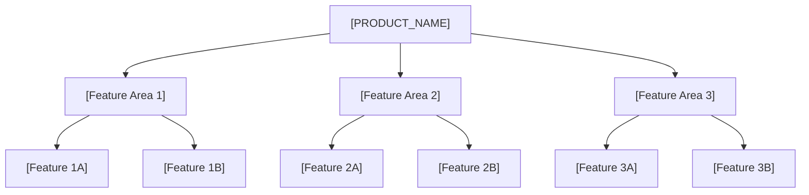
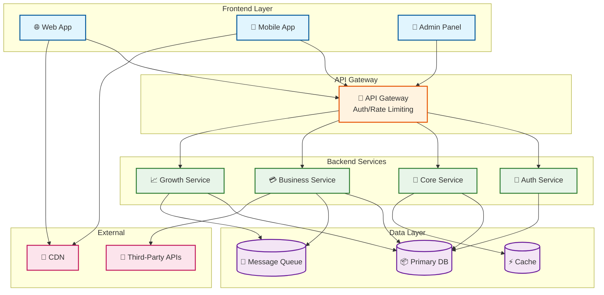

<!-- 
TEMPLATE COMPLIANCE v1.5.2 - THIS IS A TEMPLATE, MUST BE FILLED:
✓ Use Mermaid diagrams (NOT ASCII art)
✓ Fill ALL [PLACEHOLDERS] with actual content
✓ Trace content to source PDRs
✓ Validate with: ./scripts/validate-prd.sh --strict
NOTE: In final PRD, this becomes Section 2 (after Executive Summary and Document Info)
-->

# Overview: [FEATURE_AREA_NAME]

**Feature Area**: [FEATURE_AREA_NAME]
**PDRs Referenced**: [PDR_IDS]
**Generated**: [DATE]
**Section Number**: 2 (in final PRD)

---

## 2. Overview

**Purpose**: High-level description of the product - what it is and why it exists

### 2.1 Product Description

[High-level description derived from Problem PDRs and Vision/Constitution]

### 2.2 Purpose

[Describe the business/technical problem this product solves]

### 2.3 Scope

**In Scope:**

- [Core capability 1]
- [Core capability 2]

**Out of Scope:**

- [Explicitly excluded capability 1]
- [Explicitly excluded capability 2]

---

**PDR Traceability:**

| PDR | Category | Impact on Overview |
|-----|----------|-------------------|
| [PDR-XXX] | Problem | [How it affects this section] |
| [PDR-XXX] | Business Model | [How it affects this section] |

### 2.4 Feature Hierarchy

Visual representation of the product's feature areas and their relationships:

### 2.5 Architecture Overview

Visual representation of the system architecture:

**Architecture Notes**:
- Frontend layer serves multiple client types
- API Gateway handles cross-cutting concerns
- Backend services are organized by feature area
- Data layer provides persistence and messaging
- External integrations are abstracted behind service layer

### 2.6 Cross-Area Interactions

<!-- CONDITIONAL: Include when product has multiple feature areas with dependencies -->

| Feature Area A | Feature Area B | Interaction Type | Description |
|----------------|----------------|------------------|-------------|
| [Area 1] | [Area 2] | [Data flow / Event / Shared service] | [How they interact] |
| [Area 2] | [Area 3] | [Data flow / Event / Shared service] | [How they interact] |
