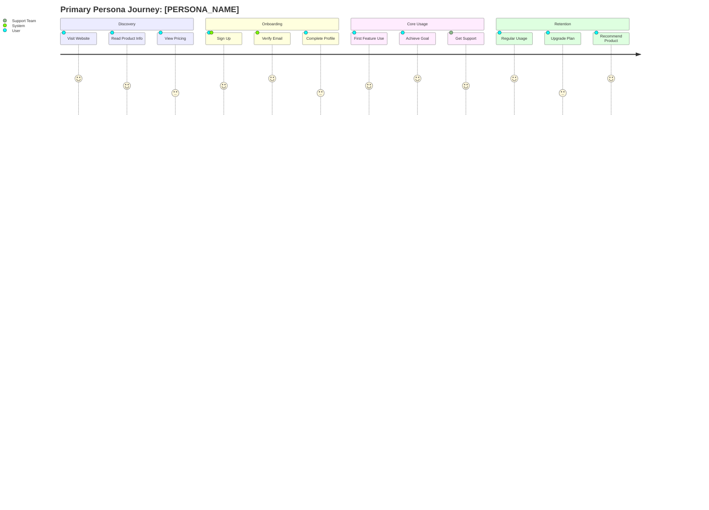

# Personas: [FEATURE_AREA_NAME]

**Feature Area**: [FEATURE_AREA_NAME]
**PDRs Referenced**: [PDR_IDS]
**Generated**: [DATE]
**Dependencies**: Problem

---

## 5. Personas

**Purpose**: Define target users and their needs

### 5.1 Primary Persona

**Name**: [Persona Name]

| Attribute | Description |
|-----------|-------------|
| **Role** | [Job title/function] |
| **Experience** | [Level of expertise] |
| **Goals** | [What they're trying to achieve] |
| **Pain Points** | [Current frustrations] |
| **Needs** | [What they need from this product] |
| **Success Quote** | "[How they describe success]" |

**PDR Reference**: PDR-XXX

### 5.2 Secondary Persona

**Name**: [Persona Name]

| Attribute | Description |
|-----------|-------------|
| **Role** | [Job title/function] |
| **Experience** | [Level of expertise] |
| **Goals** | [What they're trying to achieve] |
| **Pain Points** | [Current frustrations] |
| **Needs** | [What they need from this product] |
| **Success Quote** | "[How they describe success]" |

**PDR Reference**: PDR-XXX

### 5.3 Anti-Personas (Who This Is NOT For)

| Anti-Persona | Why Not Targeted |
|--------------|------------------|
| [Role/Type] | [Reason for exclusion] |

---

**PDR Traceability:**

| PDR | Decision | Impact on Personas |
|-----|----------|-------------------|
| [PDR-XXX] | [Decision] | [How it defines target users] |

### 5.4 User Journey Visualization

User experience flow across key touchpoints:

> 📋 **Related Visuals**: See [User Flows](../../visuals/user-flows.md) for detailed interaction diagrams.
