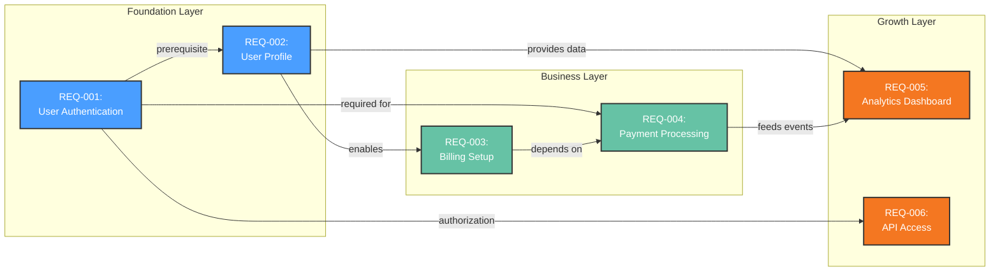
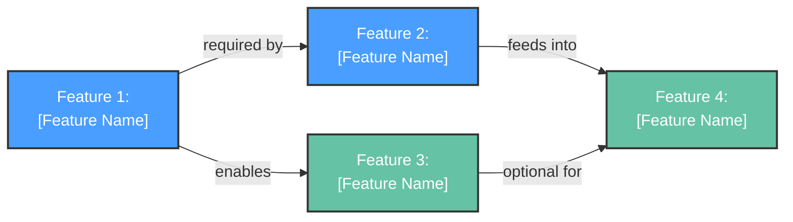
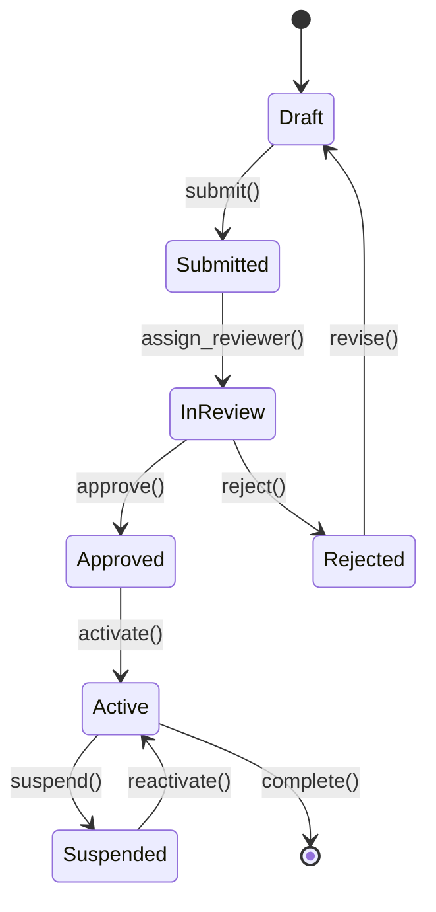

<!-- 
TEMPLATE COMPLIANCE v1.5.2 - THIS IS A TEMPLATE, MUST BE FILLED:
✓ Use Mermaid diagrams (NOT ASCII art) - flowchart for dependencies
✓ Fill ALL [PLACEHOLDERS] with actual content
✓ Trace ALL requirements to source PDRs
✓ Use REQ-XXX format for requirements
✓ Validate with: ./scripts/validate-prd.sh --strict
NOTE: In final PRD, this becomes Section 7 (Requirements)
-->

# Functional Requirements: [FEATURE_AREA_NAME]

**Feature Area**: [FEATURE_AREA_NAME]
**PDRs Referenced**: [PDR_IDS]
**Generated**: [DATE]
**Dependencies**: Personas, Goals
**Section Number**: 7 (in final PRD)

> 🛑 **CHECKPOINT SECTION v1.5.2**: This is the **cornerstone** section that shapes NFRs, Out-of-Scope, Risks, and Roadmap. After generating this section, execution MUST pause for user approval before continuing.
>
> **Why?** Requirements define what gets built, what doesn't (Out-of-Scope), associated risks, and roadmap priority. User approval ensures alignment.
>
> **Checkpoint Options**:
> - **A) Approve**: Continue to NFRs, Out-of-Scope, Risks, Roadmap
> - **B) Modify**: Edit requirements now, then continue
> - **C) Restart**: Regenerate from Problem phase
> - **D) Cancel**: Stop execution

---

## 7. Functional Requirements

**Purpose**: Define what the product must do

### 7.1 User Stories

| ID | Story | Persona | Priority | PDR |
|----|-------|---------|----------|-----|
| US-001 | As a [persona], I want to [action] so that [benefit] | [Persona] | Must | PDR-XXX |
| US-002 | As a [persona], I want to [action] so that [benefit] | [Persona] | Should | PDR-XXX |
| US-003 | As a [persona], I want to [action] so that [benefit] | [Persona] | Could | PDR-XXX |

### 7.2 Feature Requirements

#### Feature 1: [Feature Name]

**Description:** [What the feature does]

**Requirements:**

- **REQ-001:** [Specific requirement]
- **REQ-002:** [Specific requirement]

**Acceptance Criteria:**

- [ ] [Criterion 1 - testable]
- [ ] [Criterion 2 - testable]
- [ ] [Criterion 3 - testable]

**Traced to:** PDR-XXX (Scope/Feature category)

#### Feature 2: [Feature Name]

**Description:** [What the feature does]

**Requirements:**

- **REQ-003:** [Specific requirement]
- **REQ-004:** [Specific requirement]

**Acceptance Criteria:**

- [ ] [Criterion 1 - testable]
- [ ] [Criterion 2 - testable]

**Traced to:** PDR-XXX (Scope/Feature category)

### 7.3 Requirements Priority Matrix

| Priority | Count | Description |
|----------|-------|-------------|
| Must | [N] | Critical for launch |
| Should | [N] | Important but not blocking |
| Could | [N] | Nice to have |
| Won't | [N] | Explicitly excluded |

---

**PDR Traceability:**

| PDR | Decision | Impact on Requirements |
|-----|----------|------------------------|
| [PDR-XXX] | [Decision] | [How it defines requirements] |

### 7.4 Requirement Dependencies

Visual representation of dependencies between requirements:

**Dependency Notes**:
- Foundation layer requirements must be completed first
- Business layer builds on foundation
- Growth layer features can proceed in parallel after foundation
- Critical path: REQ-001 → REQ-002 → REQ-003 → REQ-004

### 7.5 Feature Dependencies

Cross-feature dependency map showing how features relate to each other:

### 7.6 State Transitions

> **Note**: Include state diagrams only when the feature involves stateful entities (e.g., orders, subscriptions, workflows). Omit this subsection if all requirements are stateless operations.

> 📋 **Related Visuals**: See [State Machine](../../visuals/state-machine.md) for detailed state transitions.
