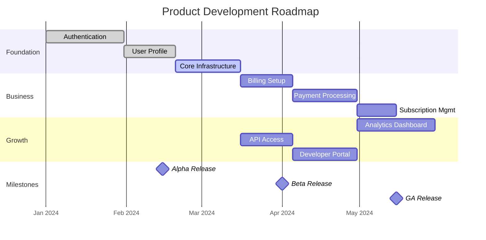

# Roadmap & Milestones: [FEATURE_AREA_NAME]

**Feature Area**: [FEATURE_AREA_NAME]
**PDRs Referenced**: [PDR_IDS]
**Generated**: [DATE]
**Dependencies**: Requirements, Metrics

---

## 11. Roadmap & Milestones

**Purpose**: Define product release milestones with feature groupings

### 11.1 Roadmap Overview

### 11.2 Milestone 1: [Name] - [Target Date]

**Demo Sentence:** "After this milestone, the user can: [observable capability]"

**Status:** Planned | In Progress | Complete

**Release Goal:** [What this milestone achieves]

| Feature | Priority | Demo Sentence | Dependencies |
|---------|----------|---------------|--------------|
| [Feature spec name] | Must | "user can ___" | None (leaf) |
| [Feature spec name] | Must | "user can ___" | Depends on [Feature] |
| [Feature spec name] | Should | "user can ___" | Depends on [Feature], [Feature] |

**Success Criteria:**

| Metric | Target | Measurement |
|--------|--------|-------------|
| [Metric] | [Target] | [Method] |

**PDR Reference:** PDR-XXX

---

### 11.3 Milestone 2: [Name] - [Target Date]

**Demo Sentence:** "After this milestone, the user can: [observable capability]"

**Status:** Planned | In Progress | Complete

**Release Goal:** [What this milestone achieves]

| Feature | Priority | Demo Sentence | Dependencies |
|---------|----------|---------------|--------------|
| [Feature spec name] | Must | "user can ___" | None (leaf) |
| [Feature spec name] | Should | "user can ___" | Depends on [Feature] |

**Features Deferred from Previous:**

- [Feature] - deferred to this milestone

**Success Criteria:**

| Metric | Target | Measurement |
|--------|--------|-------------|
| [Metric] | [Target] | [Method] |

**PDR Reference:** PDR-XXX

---

### 11.4 Milestone 3: [Name] - [Target Date]

**Demo Sentence:** "After this milestone, the user can: [observable capability]"

**Status:** Planned | In Progress | Complete

**Release Goal:** [What this milestone achieves]

| Feature | Priority | Demo Sentence | Dependencies |
|---------|----------|---------------|--------------|
| [Feature spec name] | Must | "user can ___" | None (leaf) |

**PDR Reference:** PDR-XXX

---

### 11.5 Milestones Traced to PDRs

| Milestone | PDR | Target Date | Status |
|-----------|-----|-------------|--------|
| Milestone 1 | PDR-XXX | [Date] | [Status] |
| Milestone 2 | PDR-XXX | [Date] | [Status] |
| Milestone 3 | PDR-XXX | [Date] | [Status] |

---

**PDR Traceability:**

| PDR | Decision | Impact on Roadmap |
|-----|----------|-------------------|
| [PDR-XXX] | [Decision] | [How it shapes milestones] |
