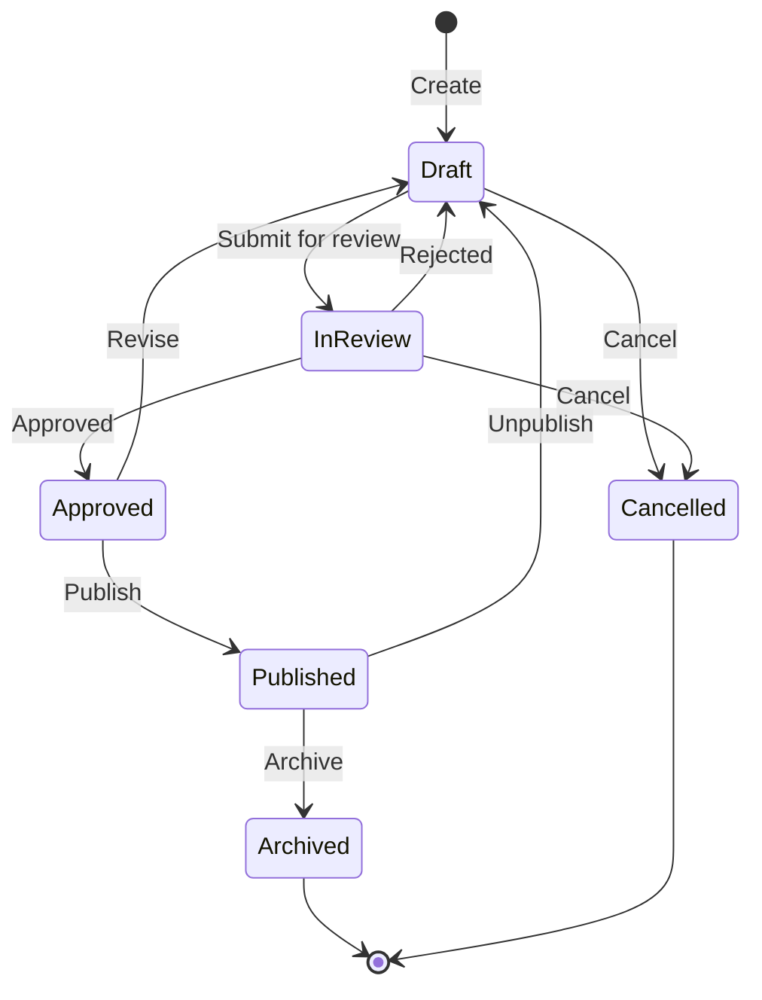

# State Machines: [FEATURE_AREA_NAME]

**Feature Area**: [FEATURE_AREA_NAME]  
**Generated**: [DATE]  
**Related**: [Link to Requirements](../PRD.md#7-functional-requirements)

---

## Feature: [Feature Name with States]

### State Diagram

### State Definitions

| State | Description | Entry Criteria | Exit Criteria | Permissions |
|-------|-------------|----------------|---------------|-------------|
| **Draft** | Initial creation state | Object created | Submitted or cancelled | Owner: edit, delete |
| **In Review** | Pending approval | Submitted for review | Approved, rejected, or cancelled | Owner: view, Reviewer: approve/reject |
| **Approved** | Ready to publish | Reviewer approved | Published or revised back to draft | Owner: publish, Admin: edit |
| **Published** | Live and visible | Published action taken | Archived or unpublished | Admin: archive |
| **Archived** | No longer active | Archive action | - | Admin: view only |
| **Cancelled** | Abandoned work | Cancel action | - | Owner: view only |

### Transitions

| From | To | Trigger | Validation | Side Effects |
|------|----|---------|------------|--------------|
| Draft | In Review | User submits | Required fields complete | Notification sent to reviewers |
| In Review | Approved | Admin approves | Meets criteria | Status updated, log entry |
| In Review | Draft | Rejected | Reviewer feedback provided | Feedback sent to owner |
| Approved | Published | Publish action | Scheduled time (optional) | Public visibility enabled |
| Approved | Draft | Revise action | - | Returns to editing mode |

### State-Specific Rules

#### Draft State
- ✅ Can edit all fields
- ✅ Can delete
- ✅ Can submit for review
- ❌ Not visible to public

#### In Review State
- ❌ Cannot edit (locked)
- ✅ Can view
- ✅ Can withdraw (back to Draft)
- ❌ Cannot delete

#### Published State
- ⚠️ Limited edits (metadata only)
- ✅ Publicly visible
- ✅ Can unpublish (back to Draft)
- ✅ Can archive

### Events & Notifications

| Transition | Event | Notification To |
|------------|-------|-----------------|
| Draft → In Review | submitted | Reviewers |
| In Review → Approved | approved | Owner |
| In Review → Draft | rejected | Owner |
| Approved → Published | published | Subscribers |
| Any → Cancelled | cancelled | Stakeholders |

### Error Handling

| Error | State | Recovery |
|-------|-------|----------|
| Invalid transition | Any | Show error, remain in current state |
| Permission denied | Any | Log attempt, show unauthorized message |
| Concurrent edit | Draft | Lock detection, merge or retry |

---

## Feature 2: [Another Feature with States]

[... repeat structure ...]

---

## Navigation

- [← Back to PRD Requirements](../PRD.md#7-functional-requirements)
- [← Back to PRD](../PRD.md)
