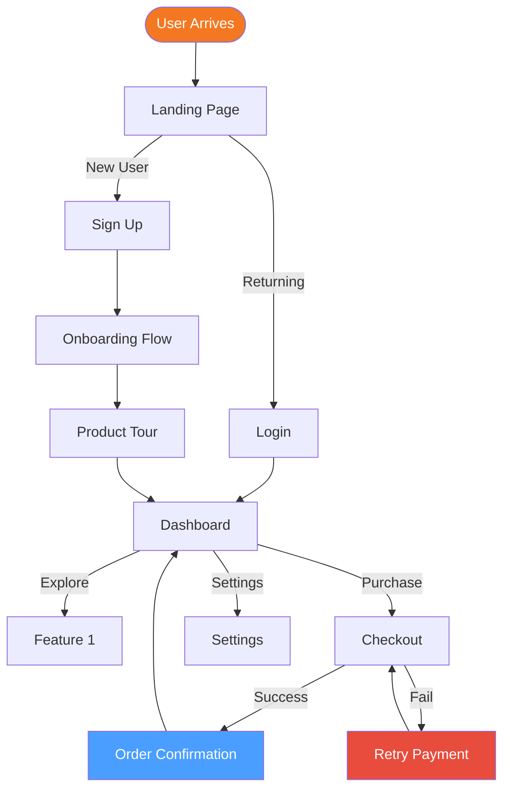
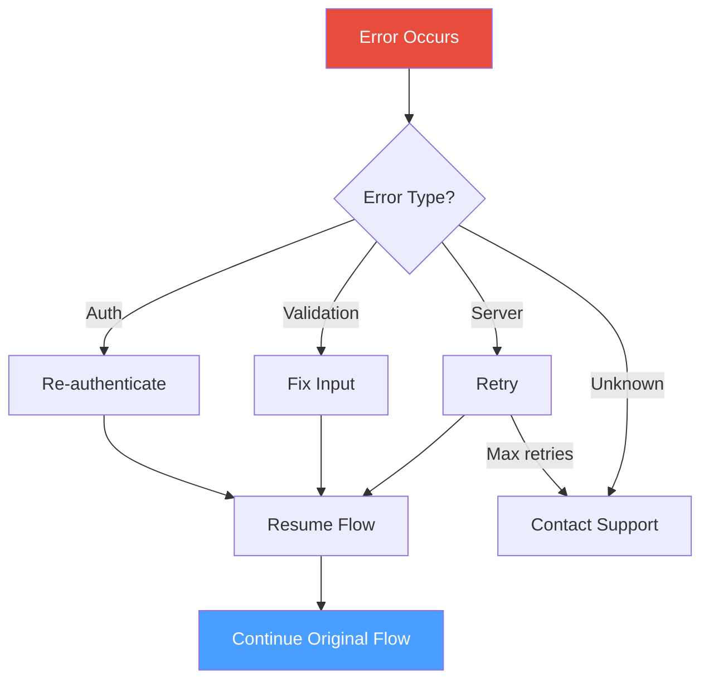

# User Flows: [FEATURE_AREA_NAME]

**Feature Area**: [FEATURE_AREA_NAME]  
**PDRs Referenced**: [PDR_IDS]  
**Generated**: [DATE]  
**Related**: [Link to Personas in PRD](../PRD.md#6-target-personas)

---

## Primary User Flows

### Flow 1: [Flow Name] for [Persona]

**Entry Points**: Landing page, Direct link  
**Exit Points**: Purchase complete, Session timeout  
**Success Criteria**: User completes primary action  
**Avg. Steps**: [N]  
**Conversion Rate**: [%]

#### Steps Detail

| Step | Action | UI Element | Success Metric |
|------|--------|------------|----------------|
| 1 | Arrive | Landing Page | Page load < 2s |
| 2 | Sign Up/Login | Auth form | Submission rate |
| 3 | Onboarding | Tutorial | Completion rate |
| 4 | Dashboard | Overview | Time to value |
| 5 | Action | Feature | Task completion |

### Flow 2: [Flow Name] for [Persona]

[... repeat structure ...]

---

## Alternative Flows

### Error Handling Flow

### Edge Cases

| Scenario | Flow | Handling |
|----------|------|----------|
| Session timeout | Any | Redirect to login, return after auth |
| Network failure | Checkout | Retry 3x, then save draft |
| Invalid input | Forms | Inline validation, error messages |

---

## Flow Summary Table

| Flow | Persona | Entry Point | Success Criteria | Avg Steps | Conversion |
|------|---------|-------------|------------------|-----------|------------|
| Onboarding | New User | Landing | Dashboard | 5 | [%] |
| Purchase | All | Product | Confirmation | 4 | [%] |
| Settings Update | Existing | Dashboard | Saved | 3 | [%] |

## Metrics & KPIs

| Metric | Target | Current | Status |
|--------|--------|---------|--------|
| Flow completion rate | >80% | [%] | ✅/⚠️ |
| Time to complete | <5 min | [X] min | ✅/⚠️ |
| Drop-off rate | <20% | [%] | ✅/⚠️ |
| Error rate | <5% | [%] | ✅/⚠️ |

---

**Navigation**: [← Back to PRD Personas Section](../PRD.md#6-target-personas)
