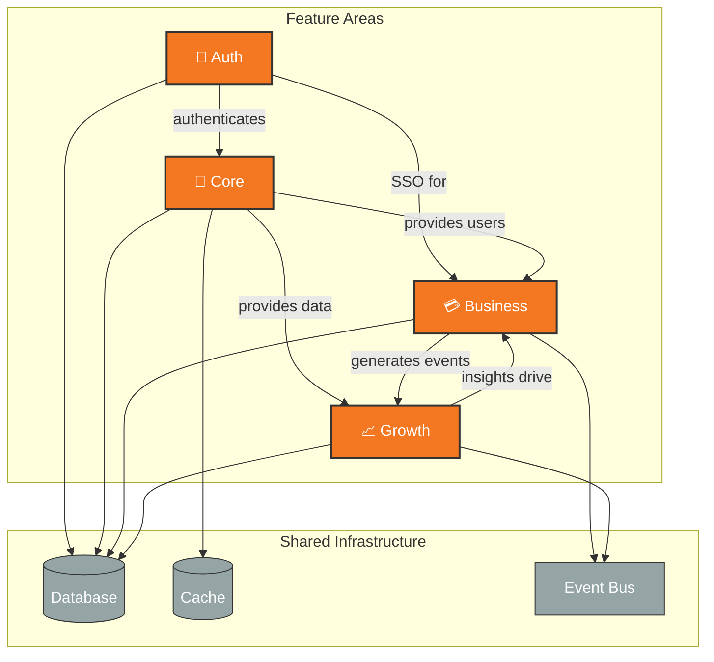

# Cross-Feature-Area Map: [PRODUCT_NAME]

> **Generated**: [DATE]  
> **Last Updated**: [DATE]  
> **Source**: Cross-feature-area analysis from `/product.init` or `/product.specify`

---

## Feature-Area Interactions

---

## Cross-Area Patterns

| Pattern | Areas Involved | Type | Notes |
|---------|---------------|------|-------|
| User Authentication | Auth, Core, Business | Shared Service | Single sign-on across all areas |
| Event Streaming | Business, Growth | Data Flow | Purchase events → Analytics |
| Shared Database | All | Infrastructure | Centralized user and transaction data |
| Caching Layer | Core, Business | Performance | Shared Redis cache |

## Integration Points

| Source Area | Target Area | Integration | Method | Frequency |
|-------------|-------------|-------------|--------|-----------|
| Auth | Core | User context | JWT token | Real-time |
| Core | Business | User profile | API call | On demand |
| Business | Growth | Events | Message queue | Real-time |
| Growth | Business | Insights | API polling | Hourly |

## Cross-Area Inconsistencies (If Any)

⚠️ **Flag for Clarify**:

| Issue | Areas | Type | Recommended Action |
|-------|-------|------|-------------------|
| Priority mismatch | Core vs Business | UX conflict | Run `/product.clarify` |
| Metric definition | Business vs Growth | Data inconsistency | Standardize in PDR |

---

## Navigation

- [← Back to PRD](../PRD.md)
- [Feature Hierarchy ←](feature-hierarchy.md)
- [Feature Dependencies ←](feature-deps.md)
- [Roadmap Timeline →](roadmap-timeline.md)
