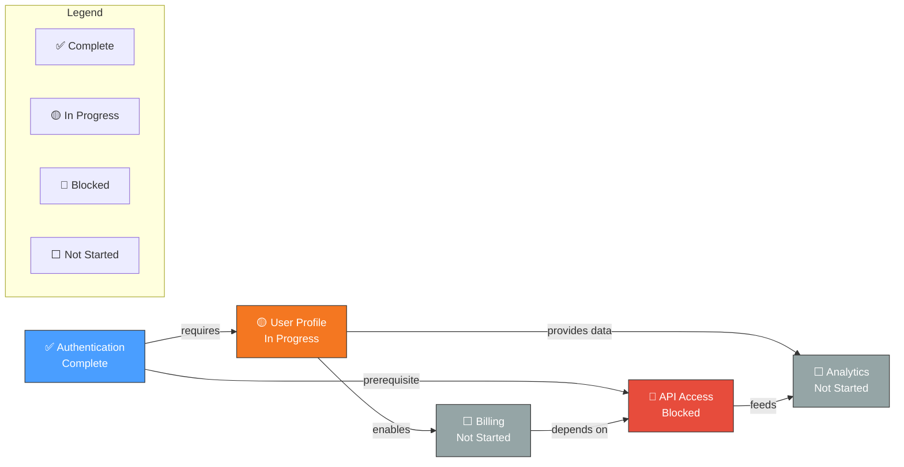

# Feature Dependencies: [PRODUCT_NAME]

> **Generated**: [DATE] from PRD.md Section 7  
> **Last Updated**: [DATE]  
> **Auto-refresh**: Run `/product.implement --refresh-diagrams` to update

---

## Dependency Graph

---

## Dependency Matrix

| Feature | Depends On | Blocks | Status | Risk Level |
|---------|-----------|--------|--------|------------|
| User Profile | Authentication | Billing, API | In Progress | Medium |
| Billing | User Profile, API | - | Not Started | High (API blocked) |
| API | Authentication | Billing, Analytics | Blocked | **Critical** |
| Analytics | User Profile, API | - | Not Started | Medium |

## Critical Path

**Path 1**: Authentication → User Profile → Billing  
**Path 2**: Authentication → API → Billing  

*Critical path length: 3 features*  
*Current blocker: API Access*

## Blockers

| Blocked Feature | Blocked By | Impact | Resolution Needed |
|-----------------|------------|--------|-------------------|
| Billing | API Access | **High** - Revenue feature | Unblock API first |
| Analytics | API Access | Medium - Growth feature | Can use mock data temporarily |

## Navigation

- [← Back to PRD](../PRD.md)
- [Feature Hierarchy ←](feature-hierarchy.md)
- [Cross-Feature-Area Map →](cross-area-map.md)
