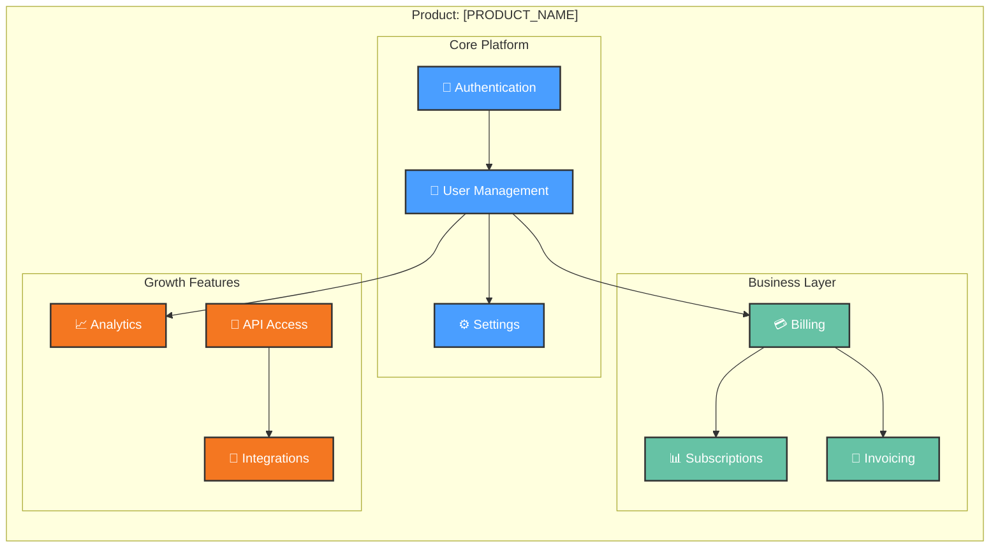

# Feature Hierarchy: [PRODUCT_NAME]

> **Generated**: [DATE] from PRD.md Section 7 (Functional Requirements)  
> **Last Updated**: [DATE]  
> **Auto-refresh**: Run `/product.implement --refresh-diagrams` to update  
> 
> This diagram shows the hierarchical structure of product features.  
> For dependencies between features, see [feature-deps.md](feature-deps.md).

---

## Feature Structure

---

## Feature Breakdown by Area

| Area | Features | Status | Completion |
|------|----------|--------|------------|
| **Core** | Auth, Users, Settings | [STATUS] | [%] |
| **Business** | Billing, Subscriptions, Invoices | [STATUS] | [%] |
| **Growth** | Analytics, API, Integrations | [STATUS] | [%] |

## Legend

- 🔐 **Authentication**: User identity and access management
- 👤 **User Management**: Profiles, preferences, accounts
- ⚙️ **Settings**: Configuration and customization
- 💳 **Billing**: Payment processing and transactions
- 📊 **Subscriptions**: Plan management and renewals
- 📄 **Invoicing**: Bill generation and delivery
- 📈 **Analytics**: Reporting and insights
- 🔌 **API Access**: Developer interfaces
- 🔗 **Integrations**: Third-party connections

---

## Navigation

- [← Back to PRD](../PRD.md)
- [Feature Dependencies →](feature-deps.md)
- [Cross-Feature-Area Map →](cross-area-map.md)
