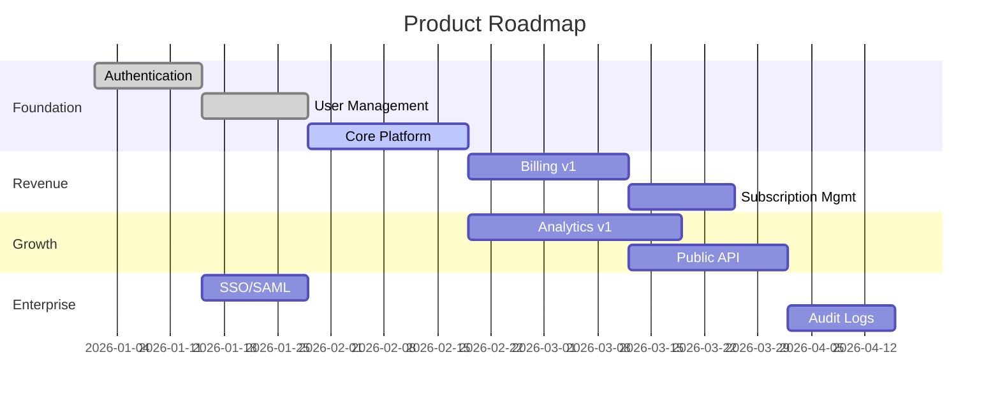

# Roadmap Timeline: [PRODUCT_NAME]

> **Generated**: [DATE] from PRD.md Section 11 (Roadmap) + PDR Milestones  
> **Last Updated**: [DATE]  
> **Auto-sync**: Run `/product.roadmap --sync` to pull from external tools

---

## Gantt Chart



---

## Milestone Tracking

| Milestone | Target Date | Status | PDR Reference | Completion |
|-----------|-------------|--------|---------------|------------|
| **MVP Launch** | 2026-02-01 | ✅ Complete | [PDR-001](#) | 100% |
| **Beta Release** | 2026-03-01 | 🟡 In Progress | [PDR-002](#) | 65% |
| **v1.0 GA** | 2026-04-15 | ⬜ Planned | [PDR-003](#) | 0% |
| **Enterprise Ready** | 2026-06-01 | ⬜ Planned | [PDR-004](#) | 0% |

## Sync with External Tools

**To sync milestones with GitHub, GitLab, Jira, or Linear**, run:

```
/product.roadmap --sync
```

The agent will:
1. Detect available tools (MCP preferred, CLI fallback)
2. Pull milestones from your project management tool
3. Update this timeline automatically
4. Report sync status

### Last Sync Attempt

| Tool | Date | Status | Details |
|------|------|--------|---------|
| [Tool Name] | [DATE] | [Status] | [Details] |

### Supported Tools

The agent can sync with:
- **GitHub Projects** (MCP or `gh` CLI)
- **GitLab** (MCP or `glab` CLI)
- **Jira** (MCP or `jira` CLI)
- **Linear** (MCP or `linear` CLI)

### Manual Sync

If automatic sync fails, you can:
1. Export milestones from your tool as CSV/JSON
2. Share the file with the agent
3. Agent will parse and update this timeline

---

## Navigation

- [← Back to PRD](../PRD.md)
- [Feature Dependencies ←](feature-deps.md)
- [Cross-Feature-Area Map ←](cross-area-map.md)
