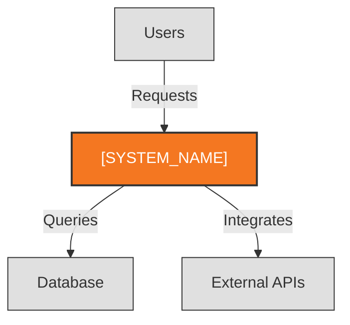
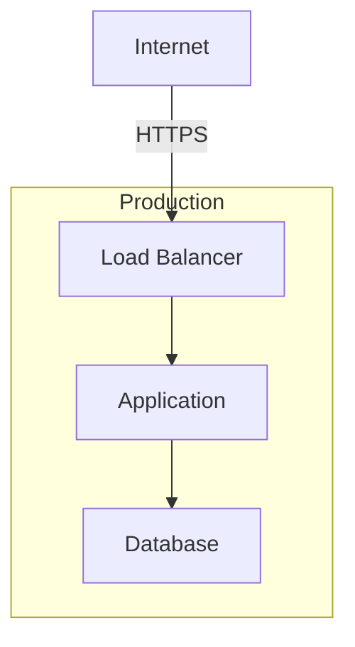

# Architecture Description: [SYSTEM_NAME]

**Version**: 1.0 | **Created**: [DATE] | **Last Updated**: [DATE]
**Author**: [AUTHOR/AI] | **Status**: Draft | Review | Approved
**ADR Reference**: [memory/adr.md](memory/adr.md)

> This is a lean architecture description for small-to-medium teams.
> For the full Rozanski & Woods template, use `AD-template.md`.

---

## 1. Risks, Gaps & Recommendations

> The most actionable section — what's missing, what could break, and what to fix first.

### Critical (Address Soon)

| Finding | Impact | Recommendation |
|---------|--------|----------------|
| [FINDING] | [IMPACT] | [RECOMMENDATION] |

### Important (Plan For)

| Finding | Impact | Recommendation |
|---------|--------|----------------|
| [FINDING] | [IMPACT] | [RECOMMENDATION] |

### Nice to Have

| Finding | Impact | Recommendation |
|---------|--------|----------------|
| [FINDING] | [IMPACT] | [RECOMMENDATION] |

---

## 2. System Overview

[2-3 sentences: What does this system do? Who uses it? What problem does it solve?]

---

## 3. Context Diagram

**Purpose**: The system and everything it talks to

### External Dependencies

| Dependency | Purpose | Failure Impact |
|------------|---------|----------------|
| [DEPENDENCY] | [PURPOSE] | [WHAT BREAKS] |

---

## 4. Key Data Flows

Describe the 2-3 most important paths through the system in narrative form.

### [Flow 1 Name] (e.g., "User Authentication")

[Source] -> [Step 1] -> [Step 2] -> [Destination]

Brief narrative: what happens, what data moves, what can go wrong.

### [Flow 2 Name] (e.g., "Core Business Operation")

[Source] -> [Step 1] -> [Step 2] -> [Destination]

Brief narrative.

---

## 5. Deployment Topology

**Purpose**: How the system runs in production

| Environment | Infrastructure | Notes |
|-------------|----------------|-------|
| Production | [e.g., AWS EC2, Docker] | [e.g., Single instance] |
| Staging | [e.g., Same as prod] | [Optional] |
| Development | [e.g., Docker Compose] | [Local dev setup] |

---

## 6. Tech Stack Summary

| Category | Technology | Notes |
|----------|------------|-------|
| Language | [e.g., TypeScript] | |
| Framework | [e.g., Next.js] | |
| Database | [e.g., PostgreSQL] | |
| ORM | [e.g., Prisma] | |
| Cloud | [e.g., AWS] | |
| CI/CD | [e.g., GitHub Actions] | |
| Monitoring | [e.g., None / Datadog] | |

---

## ADR Summary

Detailed Architecture Decision Records are maintained in [memory/adr.md](memory/adr.md).

| ID | Decision | Confidence |
|----|----------|------------|
| ADR-001 | [Title] | [HIGH/MED/LOW] |
