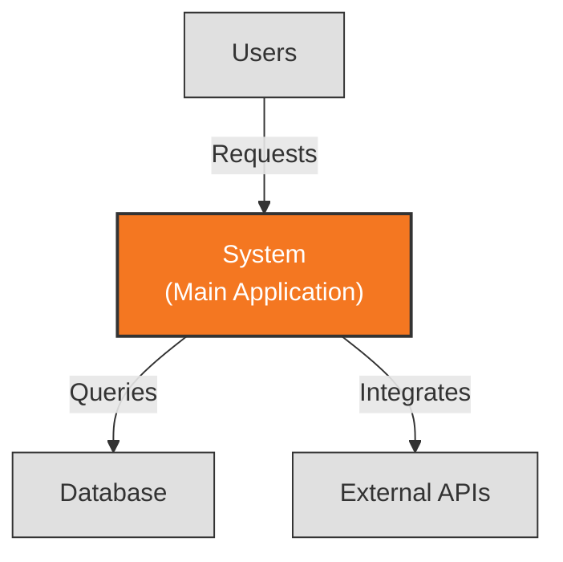
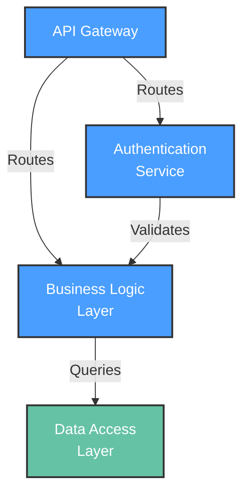
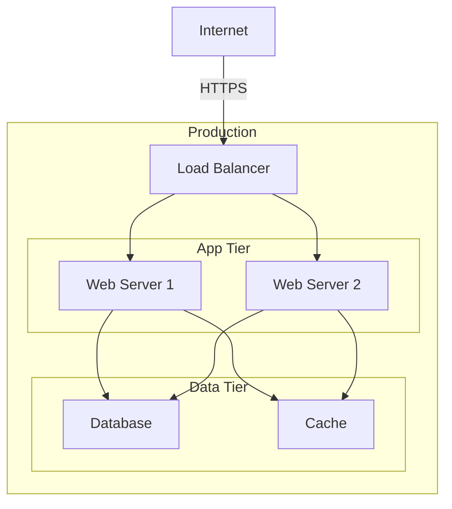

# Architecture Description: [SYSTEM_NAME]

**Version**: 1.0 | **Created**: [DATE] | **Last Updated**: [DATE]  
**Architect**: [AUTHOR/AI] | **Status**: Draft | Review | Approved
**ADR Reference**: [memory/adr.md](memory/adr.md)

---

## 1. Introduction

### 1.1 Purpose

[Describe why this system exists - the business/technical problem it solves]

### 1.2 Scope

**In Scope:**

- [Feature/capability 1]
- [Feature/capability 2]

**Out of Scope:**

- [Explicitly excluded feature/capability 1]
- [Explicitly excluded feature/capability 2]

### 1.3 Definitions & Acronyms

| Term | Definition |
|------|------------|
| AD | Architecture Description - this document |
| ADR | Architecture Decision Record - documented architectural decisions |

---

## 2. Stakeholders & Concerns

| Stakeholder | Role | Key Concerns | Priority |
|-------------|------|--------------|----------|
| [STAKEHOLDER_1] | [e.g., Product Owner] | [e.g., Feature delivery, cost control] | High |
| [STAKEHOLDER_2] | [e.g., Operations Team] | [e.g., System uptime, deployability] | High |
| [STAKEHOLDER_3] | [e.g., Security Officer] | [e.g., Data protection, compliance] | Critical |
| [STAKEHOLDER_4] | [e.g., End Users] | [e.g., Performance, usability] | High |

---

## 3. Architectural Views (Rozanski & Woods)

### 3.1 Context View

**Purpose**: Define system scope and external interactions

#### 3.1.1 System Scope

[High-level description of what the system does and its boundaries]

#### 3.1.2 External Entities

| Entity | Type | Interaction Type | Data Exchanged | Protocols |
|--------|------|------------------|----------------|-----------|
| [ENTITY_1] | User/System/API | [e.g., REST API, UI] | [e.g., User credentials] | [e.g., HTTPS] |
| [ENTITY_2] | [External System] | [Integration method] | [Data format] | [Protocol] |

#### 3.1.3 Context Diagram



#### 3.1.4 External Dependencies

| Dependency | Purpose | SLA Expectations | Fallback Strategy |
|------------|---------|------------------|-------------------|
| [DEPENDENCY_1] | [Purpose] | [e.g., 99.9% uptime] | [e.g., Cache, degraded mode] |

---

### 3.2 Functional View

**Purpose**: Describe functional elements, their responsibilities, and interactions

#### 3.2.1 Functional Elements

| Element | Responsibility | Interfaces Provided | Dependencies |
|---------|----------------|---------------------|--------------|
| [COMPONENT_1] | [e.g., User authentication] | [e.g., REST /auth/*] | [e.g., Database] |
| [COMPONENT_2] | [Responsibility] | [Interfaces] | [Dependencies] |

#### 3.2.2 Element Interactions



#### 3.2.3 Functional Boundaries

**What this system DOES:**

- [Functionality 1]
- [Functionality 2]

**What this system does NOT do:**

- [Excluded functionality 1]
- [Excluded functionality 2]

---

### 3.3 Information View

**Purpose**: Describe data storage, management, and flow

#### 3.3.1 Data Entities

| Entity | Storage Location | Owner Component | Lifecycle | Access Pattern |
|--------|------------------|-----------------|-----------|----------------|
| [ENTITY_1] | [e.g., PostgreSQL] | [e.g., UserService] | [e.g., Create-Update-Archive] | [e.g., Read-heavy] |

#### 3.3.2 Data Flow

**Key Data Flows:**

1. **[Flow Name]**: [Source] -> [Transformation] -> [Destination]
2. **[Flow Name]**: [Description of data movement]

#### 3.3.3 Data Quality & Integrity

- **Consistency Model**: [e.g., Eventual, Strong, ACID]
- **Validation Rules**: [Key data validation points]
- **Retention Policy**: [Data lifecycle requirements]
- **Backup Strategy**: [Backup approach]

---

### 3.4 Concurrency View

**Purpose**: Describe runtime processes, threads, and coordination

#### 3.4.1 Process Structure

| Process | Purpose | Scaling Model | State Management |
|---------|---------|---------------|------------------|
| [PROCESS_1] | [e.g., API Server] | [e.g., Horizontal - stateless] | [Stateless/Stateful] |

#### 3.4.2 Thread Model

- **Threading Strategy**: [e.g., Thread pool, Event-driven async]
- **Async Patterns**: [e.g., Async/await, reactive streams]
- **Resource Pools**: [e.g., Database connection pool]

#### 3.4.3 Coordination Mechanisms

- **Synchronization**: [e.g., Distributed locks via Redis]
- **Communication**: [e.g., Message queues, event bus]
- **Deadlock Prevention**: [e.g., Lock ordering, timeouts]

---

### 3.5 Development View

**Purpose**: Constraints for developers - code organization, dependencies, CI/CD

#### 3.5.1 Code Organization

```text
project-root/
├── src/
│   ├── api/              # API endpoints
│   ├── services/         # Business logic
│   ├── models/           # Data models
│   └── repositories/     # Data access
├── tests/
│   ├── unit/
│   ├── integration/
│   └── e2e/
└── infra/                # Infrastructure as code
```

#### 3.5.2 Module Dependencies

**Dependency Rules:**

- API layer depends on Services layer (not vice versa)
- Services layer depends on Repositories layer
- No circular dependencies allowed

#### 3.5.3 Build & CI/CD

- **Build System**: [e.g., npm, gradle, cargo]
- **CI Pipeline**: [Key stages]
- **Deployment Strategy**: [e.g., Blue-green, rolling]

#### 3.5.4 Development Standards

- **Coding Standards**: [e.g., ESLint config, PEP 8]
- **Review Requirements**: [e.g., 2 approvals]
- **Testing Requirements**: [e.g., 80% coverage]

---

### 3.6 Deployment View

**Purpose**: Physical environment - nodes, networks, storage

#### 3.6.1 Runtime Environments

| Environment | Purpose | Infrastructure | Scale |
|-------------|---------|----------------|-------|
| Production | Live users | [e.g., AWS EKS] | [e.g., 10 nodes] |
| Staging | Pre-release | [e.g., AWS EKS] | [e.g., 3 nodes] |
| Development | Dev testing | [e.g., Docker Compose] | [e.g., 1 node] |

#### 3.6.2 Network Topology



#### 3.6.3 Hardware Requirements

| Component | CPU | Memory | Storage |
|-----------|-----|--------|---------|
| Web Server | [e.g., 2 cores] | [e.g., 4GB] | [e.g., 20GB] |
| Database | [Specs] | [Specs] | [Specs] |

---

### 3.7 Operational View

**Purpose**: Operations, support, and maintenance in production

#### 3.7.1 Operational Responsibilities

| Activity | Owner | Frequency | Automation |
|----------|-------|-----------|------------|
| Deployment | DevOps | On-demand | Automated |
| Backup | Operations | Daily | Automated |
| Monitoring | SRE | Continuous | Automated |

#### 3.7.2 Monitoring & Alerting

- **Key Metrics**: [e.g., Latency, error rate, throughput]
- **Alerting Rules**: [e.g., Error rate > 1% -> Page on-call]
- **Logging Strategy**: [e.g., ELK stack, 30-day retention]

#### 3.7.3 Disaster Recovery

- **RTO**: [e.g., 1 hour]
- **RPO**: [e.g., 15 minutes]
- **Backup Strategy**: [e.g., Daily snapshots]

#### 3.7.4 Support Model

- **Tier 1**: Help desk
- **Tier 2**: Application support
- **Tier 3**: Engineering
- **On-call**: [Rotation schedule]

---

## 4. Architectural Perspectives (Cross-Cutting Concerns)

### 4.1 Security Perspective

**Applies to**: All views

#### 4.1.1 Authentication & Authorization

- **Identity Provider**: [e.g., OAuth2 via Auth0]
- **Authorization Model**: [e.g., RBAC, ABAC]
- **Session Management**: [e.g., JWT with 1-hour expiry]

#### 4.1.2 Data Protection

- **Encryption at Rest**: [e.g., AES-256]
- **Encryption in Transit**: [e.g., TLS 1.3]
- **Secrets Management**: [e.g., AWS Secrets Manager]
- **PII Handling**: [e.g., Data minimization]

#### 4.1.3 Threat Model

| Threat | View Affected | Likelihood | Impact | Mitigation |
|--------|---------------|------------|--------|------------|
| [THREAT_1] | [View] | [H/M/L] | [H/M/L] | [Mitigation] |

---

### 4.2 Performance & Scalability Perspective

**Applies to**: Functional, Concurrency, Deployment views

#### 4.2.1 Performance Requirements

| Metric | Target | Measurement |
|--------|--------|-------------|
| Response time (p95) | [e.g., <200ms] | [e.g., APM] |
| Throughput | [e.g., 1000 req/s] | [e.g., Load tests] |
| Concurrent users | [e.g., 10,000] | [Method] |

#### 4.2.2 Scalability Model

- **Horizontal Scaling**: [Approach and limits]
- **Vertical Scaling**: [Approach and limits]
- **Auto-scaling Triggers**: [e.g., CPU > 70%]

#### 4.2.3 Capacity Planning

- **Current Capacity**: [e.g., 5,000 concurrent users]
- **Growth Projections**: [e.g., 20% YoY]
- **Bottlenecks**: [Identified constraints]

---

## 5. Global Constraints & Principles

### 5.1 Technical Constraints

- [CONSTRAINT_1 - e.g., "Must run on AWS"]
- [CONSTRAINT_2 - e.g., "Python 3.11+ only"]
- [CONSTRAINT_3 - e.g., "Max deployment size: 50MB"]

### 5.2 Architectural Principles

- [PRINCIPLE_1 - e.g., "API First"]
- [PRINCIPLE_2 - e.g., "Share-nothing architecture"]
- [PRINCIPLE_3 - e.g., "Immutable infrastructure"]
- [PRINCIPLE_4 - e.g., "Defense in depth"]

---

## 6. ADR Summary

Detailed Architecture Decision Records are maintained in [memory/adr.md](memory/adr.md).

**Key Decisions:**

| ID | Decision | Status | Impact |
|----|----------|--------|--------|
| ADR-001 | [Title] | Accepted | [High/Med/Low] |
| ADR-002 | [Title] | Accepted | [High/Med/Low] |

---

## Appendix

### A. Glossary

| Term | Definition |
|------|------------|
| [TERM] | [Definition] |

### B. References

- [Architecture documentation]
- [External standards]
- [Relevant ADRs]

### C. Tech Stack Summary

**Languages**: [e.g., Python 3.11, TypeScript]  
**Frameworks**: [e.g., FastAPI, React]  
**Databases**: [e.g., PostgreSQL, Redis]  
**Infrastructure**: [e.g., Kubernetes, Terraform]  
**Cloud Platform**: [e.g., AWS]  
**CI/CD**: [e.g., GitHub Actions]  
**Monitoring**: [e.g., Datadog]
