# Architecture Description: [SYSTEM_NAME]

**Version**: [VERSION] | **Created**: [DATE] | **Last Updated**: [DATE]  
**Architect**: [AUTHOR/AI] | **Status**: [Draft/Review/Approved]

---

## 1. Introduction

### 1.1 Purpose

[Describe why this system exists - the business/technical problem it solves]

### 1.2 Scope

[Define what is in-scope and explicitly out-of-scope for this system]

**In Scope:**

- [Feature/capability 1]
- [Feature/capability 2]

**Out of Scope:**

- [Explicitly excluded feature/capability 1]
- [Explicitly excluded feature/capability 2]

### 1.3 Definitions & Acronyms

| Term | Definition |
|------|------------|
| [TERM_1] | [Definition] |
| [TERM_2] | [Definition] |

---

## 2. Stakeholders & Concerns

| Stakeholder | Role | Key Concerns | Priority |
|-------------|------|--------------|----------|
| [STAKEHOLDER_1] | [e.g., Product Owner] | [e.g., Feature delivery, cost control] | High |
| [STAKEHOLDER_2] | [e.g., Operations Team] | [e.g., System uptime, deployability] | High |
| [STAKEHOLDER_3] | [e.g., Security Officer] | [e.g., Data protection, compliance] | Critical |
| [STAKEHOLDER_4] | [e.g., End Users] | [e.g., Performance, usability] | High |

---

## 3. Architectural Views (Rozanski & Woods)

### 3.1 Context View

**Purpose**: Define system scope and external interactions

#### 3.1.1 System Scope

[High-level description of what the system does and its boundaries]

#### 3.1.2 External Entities

| Entity | Type | Interaction Type | Data Exchanged | Protocols |
|--------|------|------------------|----------------|-----------|
| [ENTITY_1] | User/System/API | [e.g., REST API, UI] | [e.g., User credentials, requests] | [e.g., HTTPS, WebSocket] |
| [ENTITY_2] | [External System] | [Integration method] | [Data format] | [Protocol] |

#### 3.1.3 Context Diagram

**Note**: Diagrams are auto-generated based on your configured format (mermaid or ascii).
To change format, edit `~/.config/specify/config.json` and set `architecture.diagram_format`.

```mermaid
graph TD
    Users["👥 Users"]
    System["🏢 System<br/>(Main Application)"]
    Database["🗄️ Database"]
    ExternalAPI["🌐 External APIs"]
    CloudServices["☁️ Cloud Services"]
    
    Users -->|Requests| System
    System -->|Queries| Database
    System -->|Integrates| ExternalAPI
    System -->|Deploys to| CloudServices
    
    classDef systemNode fill:#f47721,stroke:#333,stroke-width:2px,color:#fff
    classDef externalNode fill:#e0e0e0,stroke:#333,stroke-width:1px
    
    class System systemNode
    class Users,Database,ExternalAPI,CloudServices externalNode
```



#### 3.1.4 External Dependencies

| Dependency | Purpose | SLA Expectations | Fallback Strategy |
|------------|---------|------------------|-------------------|
| [DEPENDENCY_1] | [Purpose] | [e.g., 99.9% uptime] | [e.g., Cache, degraded mode] |
| [DEPENDENCY_2] | [Purpose] | [SLA] | [Fallback approach] |

---

### 3.2 Functional View

**Purpose**: Describe functional elements, their responsibilities, and interactions

#### 3.2.1 Functional Elements

| Element | Responsibility | Interfaces Provided | Dependencies |
|---------|----------------|---------------------|--------------|
| [COMPONENT_1] | [e.g., User authentication & authorization] | [e.g., REST /auth/*, /users/*] | [e.g., Database, Cache, Identity Provider] |
| [COMPONENT_2] | [Responsibility] | [Interfaces] | [Dependencies] |

#### 3.2.2 Element Interactions

**Note**: Auto-generated diagram based on configured format.


#### 3.2.3 Functional Boundaries

**What this system DOES:**

- [Functionality 1]
- [Functionality 2]

**What this system does NOT do (explicit exclusions):**

- [Excluded functionality 1]
- [Excluded functionality 2]

---

### 3.3 Information View

**Purpose**: Describe data storage, management, and flow

#### 3.3.1 Data Entities

| Entity | Storage Location | Owner Component | Lifecycle | Access Pattern |
|--------|------------------|-----------------|-----------|----------------|
| [ENTITY_1] | [e.g., PostgreSQL users table] | [e.g., UserService] | [e.g., Create→Update→Archive→Delete] | [e.g., Read-heavy] |
| [ENTITY_2] | [Storage] | [Owner] | [Lifecycle] | [Pattern] |

#### 3.3.2 Data Flow

[Describe how information moves through the system]

**Key Data Flows:**

1. **[Flow Name]**: [Source] → [Transformation] → [Destination]
2. **[Flow Name]**: [Description of data movement]

#### 3.3.3 Data Quality & Integrity

- **Consistency Model**: [e.g., Eventual consistency, Strong consistency, ACID transactions]
- **Validation Rules**: [Key data validation points and strategies]
- **Retention Policy**: [Data lifecycle and retention requirements]
- **Backup Strategy**: [Backup frequency, retention period, recovery approach]

---

### 3.4 Concurrency View

**Purpose**: Describe runtime processes, threads, and coordination

#### 3.4.1 Process Structure

| Process | Purpose | Scaling Model | State Management | Resource Limits |
|---------|---------|---------------|------------------|-----------------|
| [PROCESS_1] | [e.g., API Server] | [e.g., Horizontal - stateless] | [Stateless/Stateful] | [e.g., 2GB RAM, 1 CPU] |
| [PROCESS_2] | [Purpose] | [Scaling approach] | [State] | [Limits] |

#### 3.4.2 Thread Model

[Describe threading approach, async patterns, resource pools]

- **Threading Strategy**: [e.g., Thread pool with 100 workers, Event-driven async I/O]
- **Async Patterns**: [e.g., Async/await, callbacks, reactive streams]
- **Resource Pools**: [e.g., Database connection pool (50 connections), HTTP client pool]

#### 3.4.3 Coordination Mechanisms

- **Synchronization**: [e.g., Mutexes, semaphores, distributed locks via Redis]
- **Communication**: [e.g., Message queues (RabbitMQ), event bus, REST APIs]
- **Deadlock Prevention**: [e.g., Lock ordering, timeouts, retry with exponential backoff]

---

### 3.5 Development View

**Purpose**: Constraints for developers - code organization, dependencies, CI/CD

#### 3.5.1 Code Organization

```text
[Directory structure with purpose annotations]

Example:
project-root/
├── src/
│   ├── api/              # REST API endpoints and controllers
│   ├── services/         # Business logic layer
│   ├── models/           # Data models and entities
│   ├── repositories/     # Data access layer
│   └── utils/            # Shared utilities and helpers
├── tests/
│   ├── unit/             # Unit tests
│   ├── integration/      # Integration tests
│   └── e2e/              # End-to-end tests
├── docs/                 # Documentation
└── infra/                # Infrastructure as code
```

#### 3.5.2 Module Dependencies

[Dependency graph or key dependency rules]

**Dependency Rules:**

- API layer depends on Services layer (not vice versa)
- Services layer depends on Repositories layer
- No circular dependencies allowed
- External dependencies managed via [package manager]

#### 3.5.3 Build & CI/CD

- **Build System**: [e.g., npm/webpack, gradle, cargo, dotnet]
- **CI Pipeline Stages**:
  1. [Stage 1 - e.g., Lint & format check]
  2. [Stage 2 - e.g., Unit tests]
  3. [Stage 3 - e.g., Integration tests]
  4. [Stage 4 - e.g., Build artifacts]
  5. [Stage 5 - e.g., Deploy to staging]
- **Artifact Management**: [Registry type, versioning strategy]
- **Deployment Strategy**: [e.g., Blue-green, rolling updates, canary]

#### 3.5.4 Development Standards

- **Coding Standards**: [e.g., ESLint config, PEP 8, Rust fmt]
- **Review Requirements**: [e.g., 2 approvals, automated checks must pass]
- **Testing Requirements**: [e.g., 80% code coverage, all public APIs tested]
- **Documentation Requirements**: [e.g., API docs, README per module]

---

### 3.6 Deployment View

**Purpose**: Physical environment - nodes, networks, storage

#### 3.6.1 Runtime Environments

| Environment | Purpose | Infrastructure | Scale | Configuration |
|-------------|---------|----------------|-------|---------------|
| Production | Live users | [e.g., AWS EKS, 3 AZs] | [e.g., 10 nodes, auto-scale 5-50] | [Config approach] |
| Staging | Pre-release testing | [e.g., AWS EKS, 1 AZ] | [e.g., 3 nodes] | [Mirrors prod] |
| Development | Developer testing | [e.g., Docker Compose local] | [e.g., 1 node] | [Simplified config] |

#### 3.6.2 Network Topology

**Note**: Auto-generated deployment diagram based on configured format.

```mermaid
graph TB
    subgraph "Production Environment"
        LB["⚖️ Load Balancer"]
        
        subgraph "Application Tier"
            Web1["Web Server 1"]
            Web2["Web Server 2"]
            Web3["Web Server 3"]
        end
        
        subgraph "Data Tier"
            DB_Primary["🗄️ Database<br/>Primary"]
            DB_Replica["🗄️ Database<br/>Replica"]
            Cache["💾 Redis Cache"]
        end
        
        subgraph "Storage Tier"
            S3["☁️ Object Storage"]
        end
    end
    
    Internet["🌐 Internet"] -->|HTTPS| LB
    LB -->|Distributes| Web1
    LB -->|Distributes| Web2
    LB -->|Distributes| Web3
    
    Web1 -->|Reads/Writes| DB_Primary
    Web2 -->|Reads/Writes| DB_Primary
    Web3 -->|Reads/Writes| DB_Primary
    
    DB_Primary -->|Replicates to| DB_Replica
    
    Web1 -->|Caches| Cache
    Web2 -->|Caches| Cache
    Web3 -->|Caches| Cache
    
    Web1 -->|Stores files| S3
    Web2 -->|Stores files| S3
    Web3 -->|Stores files| S3
    
    classDef infraNode fill:#e74c3c,stroke:#333,stroke-width:2px,color:#fff
    classDef dataNode fill:#3498db,stroke:#333,stroke-width:2px,color:#fff
    
    class LB,Web1,Web2,Web3 infraNode
    class DB_Primary,DB_Replica,Cache,S3 dataNode
```



#### 3.6.3 Hardware Requirements

| Component | CPU | Memory | Storage | Network |
|-----------|-----|--------|---------|---------|
| Web Server | [e.g., 2 cores] | [e.g., 4GB] | [e.g., 20GB SSD] | [e.g., 1Gbps] |
| App Server | [Specs] | [Specs] | [Specs] | [Specs] |
| Database | [Specs] | [Specs] | [Specs] | [Specs] |

#### 3.6.4 Third-Party Services

| Service | Provider | Purpose | SLA | Cost Model |
|---------|----------|---------|-----|------------|
| [SERVICE_1] | [e.g., AWS RDS] | [e.g., Managed PostgreSQL] | [e.g., 99.95% uptime] | [e.g., Pay per hour] |
| [SERVICE_2] | [Provider] | [Purpose] | [SLA] | [Cost] |

---

### 3.7 Operational View

**Purpose**: Operations, support, and maintenance in production

#### 3.7.1 Operational Responsibilities

| Activity | Owner | Frequency | Automation Level | Tools |
|----------|-------|-----------|------------------|-------|
| Deployment | DevOps | On-demand | Fully automated | [e.g., Jenkins, GitHub Actions] |
| Backup | Operations | Daily | Automated | [e.g., AWS Backup] |
| Monitoring | SRE | Continuous | Automated | [e.g., Datadog, Prometheus] |
| Incident Response | On-call team | As needed | Semi-automated | [e.g., PagerDuty] |

#### 3.7.2 Monitoring & Alerting

- **Key Metrics Collected**:
  - [Metric 1 - e.g., Request latency (p50, p95, p99)]
  - [Metric 2 - e.g., Error rate by endpoint]
  - [Metric 3 - e.g., CPU/Memory utilization]
  - [Metric 4 - e.g., Database connection pool usage]

- **Alerting Rules**:
  - [Alert 1 - e.g., Error rate > 1% for 5 minutes → Page on-call]
  - [Alert 2 - e.g., p95 latency > 500ms → Slack notification]

- **Logging Strategy**:
  - [Log aggregation approach - e.g., ELK stack, CloudWatch Logs]
  - [Retention period - e.g., 30 days hot, 1 year cold storage]

#### 3.7.3 Disaster Recovery

- **RTO (Recovery Time Objective)**: [e.g., 1 hour]
- **RPO (Recovery Point Objective)**: [e.g., 15 minutes]
- **Backup Strategy**: [e.g., Automated daily snapshots with 30-day retention]
- **Recovery Procedures**: [Reference to runbook or key steps]

#### 3.7.4 Support Model

- **Tier 1**: [e.g., Help desk - user issues, password resets]
- **Tier 2**: [e.g., Application support - configuration, known issues]
- **Tier 3**: [e.g., Engineering - code bugs, architectural issues]
- **Escalation Path**: [Description of escalation process]
- **On-call Rotation**: [e.g., 24/7 coverage, 1-week rotations]

---

## 4. Architectural Perspectives (Cross-Cutting Concerns)

### 4.1 Security Perspective

**Applies to**: All views

#### 4.1.1 Authentication & Authorization

- **Identity Provider**: [e.g., OAuth2 via Auth0, SAML via Okta, Custom JWT]
- **Authorization Model**: [e.g., RBAC (Role-Based Access Control), ABAC (Attribute-Based)]
- **Session Management**: [e.g., JWT tokens with 1-hour expiry, refresh tokens]

#### 4.1.2 Data Protection

- **Encryption at Rest**: [e.g., AES-256 for database, encrypted EBS volumes]
- **Encryption in Transit**: [e.g., TLS 1.3, certificate management via Let's Encrypt]
- **Secrets Management**: [e.g., AWS Secrets Manager, HashiCorp Vault]
- **PII Handling**: [e.g., Data minimization, anonymization for analytics]

#### 4.1.3 Threat Model

| Threat | View Affected | Likelihood | Impact | Mitigation |
|--------|---------------|------------|--------|------------|
| [THREAT_1] | [e.g., Deployment] | [High/Med/Low] | [High/Med/Low] | [e.g., WAF, rate limiting, DDoS protection] |
| [THREAT_2] | [e.g., Information] | [Likelihood] | [Impact] | [e.g., SQL injection prevention via parameterized queries] |
| [THREAT_3] | [View] | [Likelihood] | [Impact] | [Mitigation strategy] |

---

### 4.2 Performance & Scalability Perspective

**Applies to**: Functional, Concurrency, Deployment views

#### 4.2.1 Performance Requirements

| Metric | Target | Measurement Method | Current Baseline |
|--------|--------|-------------------|------------------|
| Response time (p95) | [e.g., <200ms] | [e.g., APM (New Relic), load tests] | [e.g., 150ms] |
| Response time (p99) | [e.g., <500ms] | [Method] | [Baseline] |
| Throughput | [e.g., 1000 req/s] | [e.g., Load testing with k6] | [Current] |
| Concurrent users | [e.g., 10,000] | [Method] | [Current] |

#### 4.2.2 Scalability Model

- **Horizontal Scaling**:
  - [Approach - e.g., Auto-scaling based on CPU > 70%]
  - [Limits - e.g., Max 50 nodes per cluster]
  - [Constraints - e.g., Stateless services only]

- **Vertical Scaling**:
  - [Approach - e.g., Upgrade instance types during maintenance windows]
  - [Limits - e.g., Max 32-core, 128GB RAM instances]

- **Auto-scaling Triggers**:
  - [Trigger 1 - e.g., CPU utilization > 70% for 5 minutes → Scale up]
  - [Trigger 2 - e.g., Request queue depth > 100 → Scale up]
  - [Trigger 3 - e.g., CPU < 30% for 10 minutes → Scale down]

#### 4.2.3 Capacity Planning

- **Current Capacity**: [e.g., 5,000 concurrent users, 500 req/s]
- **Growth Projections**: [e.g., 20% YoY growth expected]
- **Headroom**: [e.g., 30% capacity buffer maintained]
- **Bottlenecks Identified**: [e.g., Database write throughput, cache memory]

---

## 5. Global Constraints & Principles

### 5.1 Technical Constraints

- [CONSTRAINT_1 - e.g., "Must run on AWS infrastructure (no multi-cloud)"]
- [CONSTRAINT_2 - e.g., "Python 3.11+ only (no legacy Python versions)"]
- [CONSTRAINT_3 - e.g., "Maximum deployment package size: 50MB (Lambda limit)"]
- [CONSTRAINT_4 - e.g., "Must support IE11+ browsers (business requirement)"]

### 5.2 Architectural Principles

- [PRINCIPLE_1 - e.g., "API First: All functionality exposed via REST APIs"]
- [PRINCIPLE_2 - e.g., "Share-nothing architecture: Services communicate only via APIs"]
- [PRINCIPLE_3 - e.g., "Immutable infrastructure: No manual server changes"]
- [PRINCIPLE_4 - e.g., "Defense in depth: Multiple layers of security controls"]

---

## 6. Architecture Decision Records (ADRs)

| ID | Decision | Status | Date | Owner |
|----|----------|--------|------|-------|
| ADR-001 | [Decision title] | [Proposed/Accepted/Deprecated] | [DATE] | [PERSON] |
| ADR-002 | [Decision title] | [Status] | [DATE] | [PERSON] |

### ADR-001: [Decision Title]

**Status**: [Proposed/Accepted/Deprecated]  
**Date**: [YYYY-MM-DD]  
**Owner**: [Person/Team]

**Context**: [Describe the forces at play - technical, political, social, project. Why was this decision needed?]

**Decision**: [What was decided? State it clearly and concisely.]

**Consequences**:

- **Positive**: [Benefits of this decision]
- **Negative**: [Trade-offs and costs]
- **Risks**: [Known risks and mitigation strategies]

**Alternatives Considered**:

1. [Alternative 1]: [Why rejected]
2. [Alternative 2]: [Why rejected]

---

## Appendix

### A. Glossary

| Term | Definition |
|------|------------|
| [TERM_1] | [Full definition with context] |
| [TERM_2] | [Definition] |

### B. References

- [Architecture documentation]
- [External standards and frameworks]
- [Relevant RFC/ADR documents]
- [Vendor documentation]

### C. Tech Stack Summary

**Languages**: [e.g., Python 3.11, TypeScript 5.x, Java 17]  
**Frameworks**: [e.g., FastAPI, React 18, Spring Boot]  
**Databases**: [e.g., PostgreSQL 15, Redis 7.x]  
**Infrastructure**: [e.g., Kubernetes 1.28, Terraform]  
**Cloud Platform**: [e.g., AWS (us-east-1, us-west-2)]  
**CI/CD**: [e.g., GitHub Actions, Jenkins]  
**Monitoring**: [e.g., Datadog, Prometheus + Grafana]
