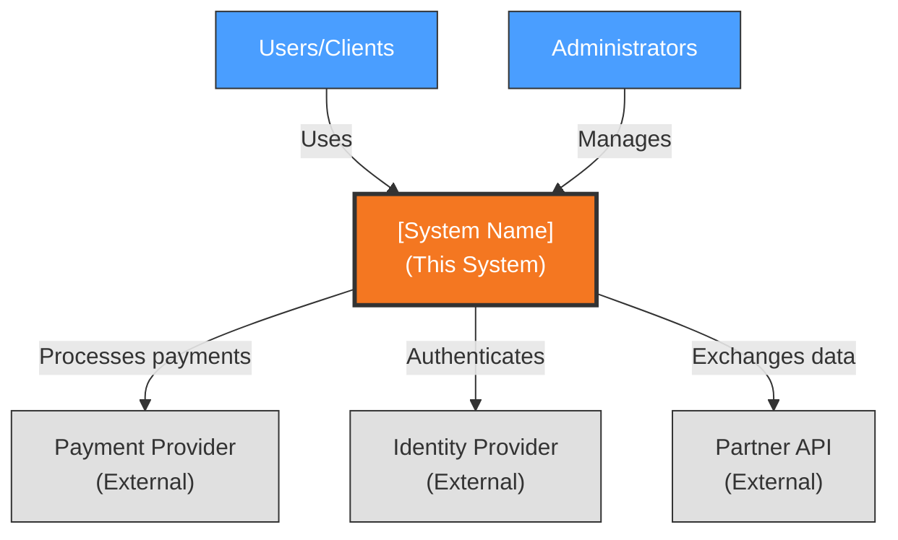
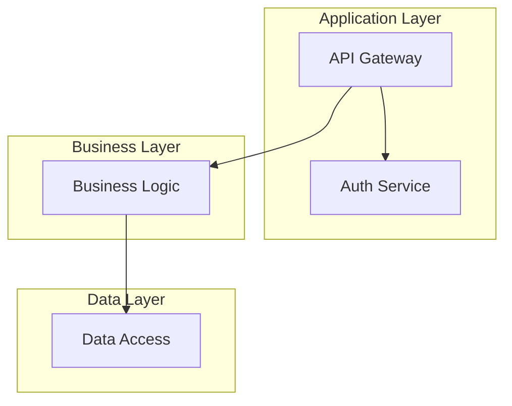
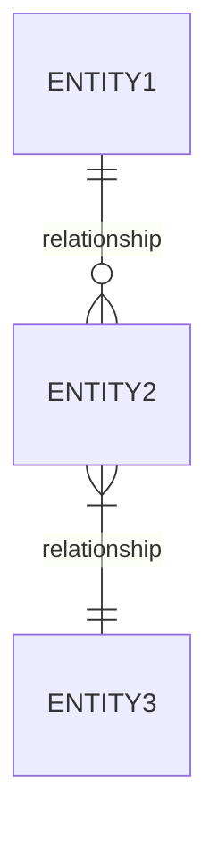
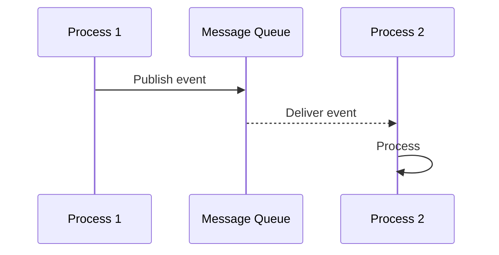
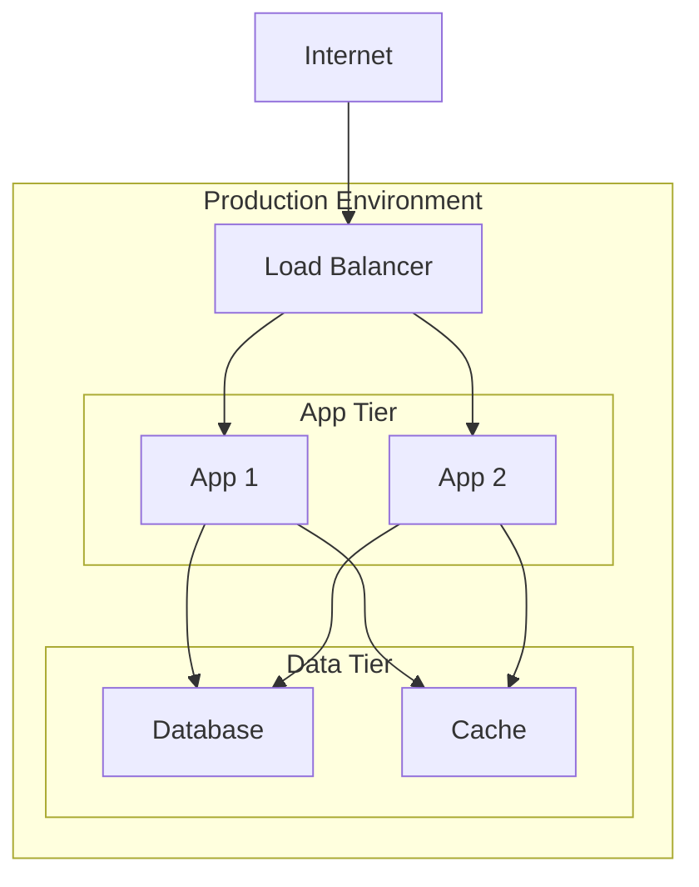

## User Input

```text
$ARGUMENTS
```

You **MUST** consider the user input before proceeding (if not empty).

**Examples of User Input**:

- `"Focus on deployment and operational views - we need infrastructure docs"`
- `"Generate all views with emphasis on security perspective"`
- `"Update existing AD.md with new ADRs from recent decisions"`
- Empty input: Generate complete Architecture Description from all ADRs

## Goal

Transform Architecture Decision Records (ADRs) into a comprehensive Architecture Description (AD.md) following the Rozanski & Woods methodology with 7 viewpoints and 2 perspectives.

**Key Insight**: ADRs capture **why** decisions were made; the Architecture Description captures **what** the system looks like as a result of those decisions.

## Role & Context

You are acting as a **Technical Writer** synthesizing ADRs into comprehensive architecture documentation. Your role involves:

- **Translating** individual ADRs into cohesive viewpoints
- **Generating** diagrams for each architectural view
- **Ensuring** consistency between ADRs and generated views
- **Producing** stakeholder-appropriate documentation

### Architecture Document Hierarchy

| Document | Purpose | Location |
|----------|---------|----------|
| `memory/adr.md` | Architectural decisions with rationale | Input |
| `AD.md` (root) | Full Architecture Description | Output |
| `memory/constitution.md` | Governance principles | Constraint |

## Outline

1. **Load ADRs**: Parse all ADRs from `memory/adr.md`
2. **Map to Views**: Determine which views each ADR affects
3. **Generate Views**: Create each of the 7 viewpoints
4. **Apply Perspectives**: Add Security and Performance perspectives
5. **Output**: Write complete `AD.md` to project root

## Execution Steps

### Phase 1: ADR Loading

**Objective**: Load and analyze existing ADRs

1. **Run Setup Script**:
   - Execute `{SCRIPT}` to prepare architecture files
   - Creates `AD.md` from template if it doesn't exist

2. **Load ADRs**:
   - Read `memory/adr.md`
   - Parse each ADR: ID, title, context, decision, consequences
   - Build decision index

3. **Load Constitution**:
   - Read `memory/constitution.md` for constraint validation
   - Extract principles that affect architecture documentation

4. **ADR-to-View Mapping**:

   | ADR Topic | Primary View | Secondary Views |
   |-----------|--------------|-----------------|
   | System Architecture Style | Functional | Context, Deployment |
   | Database Choice | Information | Deployment, Operational |
   | API Style | Functional | Context, Development |
   | Authentication | Security Perspective | Functional |
   | Deployment Platform | Deployment | Operational |
   | CI/CD Approach | Development | Operational |
   | Scaling Strategy | Performance Perspective | Concurrency, Deployment |
   | Caching Strategy | Performance Perspective | Information, Concurrency |

### Phase 2: View Generation

**Objective**: Generate each Rozanski & Woods viewpoint from ADR content

Generate views in this order (earlier views inform later ones):

#### 3.1 Context View

**Purpose**: System scope and external interactions

**ADRs to Reference**: System style, integration patterns, external dependencies

> **CRITICAL: Blackbox Requirement**
>
> The Context View MUST show the system as a **single blackbox node**. This view answers: "What does the system connect to?" NOT "What's inside the system?"
>
> **DO include**:
>
> - The system as ONE unified node (no internal components)
> - Stakeholders/Users (human actors)
> - External systems (third-party services outside your control)
> - Data flows crossing the system boundary
>
> **DO NOT include**:
>
> - Internal databases (those go in Deployment View)
> - Internal services/microservices (those go in Functional View)
> - Internal caches, queues, or storage (those go in Deployment View)
> - Implementation details of any kind

**Generate**:

- System scope description (from system style ADR)
- External entities table - ONLY stakeholders and external systems
- Context diagram showing system as single blackbox
- External dependencies table (from dependency ADRs)

**Diagram Template**:



**Validation Checklist** (verify before finalizing Context View):

- [ ] System appears as exactly ONE node
- [ ] No internal databases shown (e.g., PostgreSQL, Redis)
- [ ] No internal services shown (e.g., AuthService, UserService)
- [ ] All entities are either stakeholders OR external systems
- [ ] All connections cross the system boundary

#### 3.2 Functional View

**Purpose**: Internal components, responsibilities, interactions

**ADRs to Reference**: System style, API style, component organization

**Generate**:

- Functional elements table (from architecture style ADR)
- Element interactions diagram
- Functional boundaries (from scope decisions)

**Diagram Template**:



#### 3.3 Information View

**Purpose**: Data storage, management, and flow

**ADRs to Reference**: Database choice, data patterns, caching

**Generate**:

- Data entities table (from database ADRs)
- Data flow description
- Data quality/integrity requirements

**Diagram Template**:



#### 3.4 Concurrency View

**Purpose**: Runtime processes, threads, coordination

**ADRs to Reference**: Scaling, async patterns, messaging

**Generate**:

- Process structure table
- Thread/async model description
- Coordination mechanisms

**Diagram Template**:



#### 3.5 Development View

**Purpose**: Code organization, dependencies, CI/CD

**ADRs to Reference**: CI/CD, development standards, framework choices

**Generate**:

- Code organization structure (directory tree)
- Module dependencies description
- Build & CI/CD pipeline description
- Development standards summary

#### 3.6 Deployment View

**Purpose**: Physical environment, nodes, networks

**ADRs to Reference**: Deployment platform, infrastructure, scaling

**Generate**:

- Runtime environments table
- Network topology diagram
- Hardware requirements table
- Third-party services table

**Diagram Template**:



#### 3.7 Operational View

**Purpose**: Operations, support, maintenance

**ADRs to Reference**: Monitoring, observability, support model

**Generate**:

- Operational responsibilities table
- Monitoring & alerting description
- Disaster recovery parameters
- Support model tiers

### Phase 3: Perspective Application

**Objective**: Add cross-cutting concerns

#### 4.1 Security Perspective

**ADRs to Reference**: Authentication, authorization, encryption, compliance

**Generate**:

- Authentication & authorization approach
- Data protection measures
- Threat model table (threats, mitigations)

#### 4.2 Performance & Scalability Perspective

**ADRs to Reference**: Scaling, caching, performance targets

**Generate**:

- Performance requirements table
- Scalability model description
- Capacity planning notes

### Phase 4: Global Sections

**Objective**: Complete cross-cutting sections

1. **Global Constraints & Principles**:
   - Extract from constitution and constraint ADRs
   - Document technical constraints
   - Document architectural principles

2. **ADR Summary**:
   - Create summary table linking to `memory/adr.md`
   - List key decisions with impact levels

3. **Tech Stack Summary**:
   - Synthesize from all technology ADRs
   - Languages, frameworks, databases, infrastructure

### Phase 5: Output Generation

**Objective**: Write complete Architecture Description

1. **Structure Check**:
   - Ensure all 7 viewpoints are present
   - Ensure both perspectives are present
   - Validate diagram syntax

2. **Write AD.md**:
   - Use `templates/AD-template.md` as base
   - Replace placeholders with generated content
   - Write to project root as `AD.md`

3. **Update References**:
   - Ensure `memory/adr.md` link is correct
   - Update version and timestamp

4. **Generate Report**:

```markdown
## Architecture Description Generated

**Output**: AD.md (project root)

**Views Generated**:
- [x] Context View (based on ADR-001, ADR-003)
- [x] Functional View (based on ADR-001, ADR-002)
- [x] Information View (based on ADR-002)
- [x] Concurrency View (based on ADR-004)
- [x] Development View (based on ADR-005)
- [x] Deployment View (based on ADR-006)
- [x] Operational View (based on ADR-007)

**Perspectives Applied**:
- [x] Security (based on ADR-008)
- [x] Performance & Scalability (based on ADR-004, ADR-006)

**Diagrams Generated**: 7 (Mermaid format)

**ADR Coverage**: 8/8 ADRs incorporated

**Recommended Next Steps**:
1. Review generated AD.md for accuracy
2. Run `/spec.analyze` for consistency validation
3. Share with stakeholders for review
4. Begin feature development with `/spec.specify`
```

## Diagram Generation

### Diagram Format

Diagrams are generated based on global configuration:

```json
{
  "architecture": {
    "diagram_format": "mermaid"  // or "ascii"
  }
}
```

Configuration location: `~/.config/specify/config.json`

### Diagram Types Per View

| View | Diagram Type | Mermaid Syntax |
|------|--------------|----------------|
| Context | System boundary | `graph TD` |
| Functional | Component diagram | `graph TD` |
| Information | ER diagram | `erDiagram` |
| Concurrency | Sequence diagram | `sequenceDiagram` |
| Development | Dependency graph | `graph LR` |
| Deployment | Infrastructure | `graph TB` |
| Operational | Flowchart | `flowchart TD` |

### ASCII Fallback

If Mermaid validation fails, fall back to ASCII diagrams:

```text
┌──────────────┐
│   Component  │
└──────┬───────┘
       │
       ▼
┌──────────────┐
│   Component  │
└──────────────┘
```

## Key Rules

### ADR Traceability

- **Every view section** should reference source ADRs
- **No content** without ADR backing (except templates)
- **Flag gaps** where ADRs are missing

### Consistency

- **Terminology** must match across views
- **Components** named consistently in all diagrams
- **Technology names** exactly as stated in ADRs

### Completeness

- **All 7 viewpoints** must be generated
- **Both perspectives** must be applied
- **All sections** must have content (not just placeholders)

### Diagram Quality

- **Validate** Mermaid syntax before writing
- **Fall back** to ASCII if Mermaid fails
- **Keep diagrams** simple and readable

## Workflow Guidance & Transitions

### After `/architect.implement`

Recommended next steps:

1. **Review AD.md**: Verify architecture documentation is accurate
2. **Run `/spec.analyze`**: Validate consistency and completeness
3. **Share for Review**: Get stakeholder feedback
4. **Start Features**: Use `/spec.specify` to create feature specs

### When to Use This Command

- **After `/architect.specify`**: Generate AD from discussed ADRs
- **After `/architect.init`**: Document brownfield architecture
- **ADR Updates**: Regenerate AD.md after new decisions
- **Documentation Sprint**: Create comprehensive architecture docs

### When NOT to Use This Command

- **No ADRs exist**: Use `/architect.specify` or `/architect.init` first
- **Feature-level**: Feature AD generated via `/spec.plan --architecture`
- **Minor updates**: Use direct editing for small changes

## Context

{ARGS}
