## User Input

```text
$ARGUMENTS
```

You **MUST** consider the user input before proceeding (if not empty).

**Examples of User Input**:

- `init "B2B SaaS platform for supply chain management"`
- `map "Django monolith with PostgreSQL, React frontend, AWS deployment"`
- `update "Migrated to microservices, added event sourcing and Kafka"`
- `review "Focus on security compliance and performance scalability"`

When users provide context like this, use it to inform your architecture work. This context helps you understand system scope, constraints, and focus areas without needing to ask basic questions.

## Command Actions

The `/architect` command accepts one of the following actions as the first parameter:

```bash
/architect [action] [description]
```

**Available Actions**:

- `init`: Initialize new architecture from scratch (greenfield project)
- `map`: Scan existing codebase to reverse-engineer architecture (brownfield project)
- `update`: Update architecture based on recent code/spec changes
- `review`: Validate architecture against constitution and best practices

**Action Descriptions**:

- **init**: Creates `memory/architecture.md` from template when no architecture exists
- **map**: Analyzes existing codebase and populates architecture with detected technologies and structure
- **update**: Synchronizes architecture with current implementation state and recent changes
- **review**: Validates architecture completeness, consistency, and constitution compliance

The description after the action provides context for the architecture work (system scope, constraints, focus areas).

## Outline

The text the user typed after `/speckit.architect` in the triggering message **is** the architecture action (init/map/update/review) and context. Assume you always have it available in this conversation even if `{ARGS}` appears literally below. Do not ask the user to repeat it unless they provided an empty command.

Given that input, do this:

1. **Parse the Action**: Determine if user wants:
   - `init` - Initialize new architecture from scratch (greenfield)
   - `map` - Scan existing codebase (brownfield/reverse-engineering)
   - `update` - Sync architecture with recent changes
   - `review` - Validate architecture against constitution

2. **Load Current State**:
   - Check if `memory/architecture.md` exists
   - Load `memory/constitution.md` for alignment validation
   - Check for team directives if available

3. **Execute Appropriate Phase**: Run Phases 0-5 based on action type

4. **Generate or Update Architecture**: Write/update `memory/architecture.md`

5. **Produce Output**: Report generation results, ADRs created, and next steps

**NOTE:** The script creates or updates the architecture file before execution. You are responsible for populating it with substantial content following the Rozanski & Woods structure.

## Availability

Architecture commands are available in all workflow modes (build and spec). They operate silently - no errors or warnings if architecture.md or related files are missing. Architecture documentation is optional and can be used whenever system-level design is beneficial.

## Diagram Generation (Automatic)

Architecture diagrams are automatically generated for all 7 viewpoints based on your configured diagram format:

- **Mermaid** (default): Professional diagrams that render in GitHub/GitLab markdown
- **ASCII**: Plain text diagrams that work everywhere, including terminals

**Diagram Format Configuration:**

The diagram format is configured globally at `~/.config/specify/config.json`:

```json
{
  "architecture": {
    "diagram_format": "mermaid"  // or "ascii"
  }
}
```

**To change the diagram format:**

1. Edit your global config file
2. Change `diagram_format` to either `"mermaid"` or `"ascii"`
3. Run `/speckit.architect update` to regenerate diagrams

**Diagram Types Generated:**

| View | Mermaid Type | ASCII Alternative |
|------|--------------|-------------------|
| Context | Graph (system boundary) | Box diagram with entities |
| Functional | Component diagram | ASCII component boxes |
| Information | ER diagram | Table-like entity relationships |
| Concurrency | Sequence diagram | Timeline notation |
| Development | Dependency graph | Directory tree with arrows |
| Deployment | Infrastructure graph | Network diagram |
| Operational | Flowchart | Workflow steps |

**Diagram Validation:**

Mermaid diagrams are validated using lightweight syntax checking. If validation fails, the system automatically falls back to ASCII format for that specific diagram.

**Example Mermaid Diagram (Context View):**

```mermaid
graph TD
    Users["👥 Users"]
    System["🏢 System"]
    Database["🗄️ Database"]
    
    Users -->|Requests| System
    System -->|Queries| Database
```



**Example ASCII Diagram (Context View):**

```text
    ┌──────────────┐
    │    Users     │
    └──────┬───────┘
           │
           ▼
┌──────────────────┐
│     System       │
└──────┬───────────┘
       │
       ▼
┌──────────────────┐
│    Database      │
└──────────────────┘
```

## Goal

Generate, update, or validate comprehensive Architecture Descriptions following the Rozanski & Woods "Software Systems Architecture" methodology. Transform AI from a simple coder into a System Architect capable of describing complex, production-ready systems with structural integrity.

## Role & Context

You are acting as a **System Architect** responsible for creating and maintaining the global architecture that governs all feature development. Your architecture description serves as:

- **Strategic Context** for all `/speckit.specify` and `/speckit.plan` commands
- **Governance Framework** ensuring features align with system boundaries
- **Communication Tool** for stakeholders across technical and business domains
- **Decision Record** capturing architectural rationale and trade-offs

### Architecture Hierarchy

- Architecture operates at the **system level**, above individual features
- The `memory/architecture.md` file provides **global context** inherited by all feature specs
- Features must **validate against** architectural boundaries and constraints
- Architecture can be **updated incrementally** as features reveal new requirements

### Rozanski & Woods Methodology

- **7 Core Viewpoints**: Context, Functional, Information, Concurrency, Development, Deployment, Operational
- **2 Perspectives**: Security, Performance & Scalability (cross-cutting quality concerns)
- Each viewpoint addresses **specific stakeholder concerns**
- Architecture must be **traceable** to stakeholder needs

### Integration Points

- `context.md` for features will include **architecture summary**
- `/speckit.plan` reads architecture for **Global Constraints** validation
- Architecture updates trigger **impact analysis** across existing features

## Execution Steps

### Parse Action from User Input

The command supports four actions:

| Action | Purpose | When to Use |
|--------|---------|-------------|
| `init` | Initialize new architecture from template | Greenfield projects, new systems |
| `map` | Scan existing codebase to populate architecture | Brownfield projects, reverse engineering |
| `update` | Update architecture based on code/spec changes | After feature implementation |
| `review` | Validate architecture against constitution | Before major milestones |

**If no action specified**: Default to `init` for new projects, `update` for existing architecture.

### Phase 0: Context Discovery (for `init` and `map`)

**Objective**: Establish stakeholders, concerns, and system scope

**If user provided context in {ARGS}**: Parse it for system description, scope, and constraints. Use this to skip basic questions and focus on clarifying details.

**If user provided minimal/no context**: Follow full discovery process below.

1. **Identify Stakeholders**:
   - Read `memory/constitution.md` if it exists
   - Prompt user to identify key stakeholders (Product Owner, Operations, Security, End Users)
   - Document their primary concerns

2. **Define System Scope**:
   - What problem does this system solve?
   - What is explicitly IN scope?
   - What is explicitly OUT of scope?

3. **Load Team Directives**:
   - Check for team-ai-directives in project
   - Extract architectural principles and constraints
   - Incorporate into Global Constraints section

### Phase 1: Generate Architecture Views (for `init`)

Generate each viewpoint systematically, starting with Context View (which informs the others):

#### Order of Generation

1. **Context View** (external boundaries)
2. **Functional View** (internal components)
3. **Information View** (data flow)
4. **Concurrency View** (runtime behavior)
5. **Development View** (code organization)
6. **Deployment View** (infrastructure)
7. **Operational View** (operations)

**For each viewpoint**:

- Use the template structure from `templates/architecture-template.md`
- Fill in specific details based on user input or codebase analysis
- Use tables for structured data, diagrams for relationships
- Keep descriptions concise but complete

### Phase 2: Brownfield Mapping (for `map` action)

**Objective**: Reverse-engineer architecture from existing codebase

The script will scan the codebase and output structured findings. Use these to populate:

1. **Development View**:
   - Directory structure → Code Organization
   - Package files → Module Dependencies
   - CI/CD configs → Build & CI/CD

2. **Deployment View**:
   - `docker-compose.yml`, `Dockerfile` → Runtime Environments
   - Kubernetes manifests → Network Topology
   - Terraform/CloudFormation → Infrastructure

3. **Functional View**:
   - API routes, CLI commands → Functional Elements
   - Class/module structure → Element Interactions

4. **Information View**:
   - Database schemas, ORM models → Data Entities
   - Migration files → Data Lifecycle

**Fill gaps with user interaction**: Ask clarifying questions for aspects that cannot be inferred from code.

### Phase 3: Apply Perspectives (Security & Performance)

For each perspective, analyze how architectural decisions address quality concerns:

#### Security Perspective

- Review each viewpoint for security implications
- Document authentication/authorization approach
- Identify threat model and mitigations
- Validate against constitution security requirements

#### Performance & Scalability Perspective

- Define performance requirements (latency, throughput)
- Document scalability model (horizontal/vertical)
- Identify capacity planning approach
- Map performance concerns to specific views (Concurrency, Deployment)

### Phase 4: Update Loop (for `update` action)

**Objective**: Keep architecture synchronized with implementation reality

1. **Diff Analysis**:
   - Compare current `memory/architecture.md` with recent code/spec changes
   - Identify what changed since last architecture update

2. **Impact Analysis**:
   - New database table? → Update **Information View**
   - New microservice? → Update **Functional View** and **Deployment View**
   - New message queue? → Update **Concurrency View**
   - New dependency? → Update **Development View**

3. **Refinement**:
   - Update affected sections with specific changes
   - Add ADR (Architecture Decision Record) if significant decision made
   - Update "Last Updated" timestamp

### Phase 5: Review & Validation (for `review` action)

1. **Constitution Alignment**:
   - Load `memory/constitution.md`
   - Verify architecture adheres to all constitutional principles
   - Report violations or conflicts

2. **Perspective Coverage**:
   - Validate Security perspective is addressed in all relevant views
   - Validate Performance perspective is addressed
   - Identify gaps or insufficient detail

3. **Completeness Check**:
   - All 7 viewpoints present?
   - All mandatory sections filled in?
   - Stakeholder concerns addressed?

4. **Report**:
   - Summary of findings
   - List of gaps or issues
   - Recommendations for improvement

## Output Format

### File Location

- **Primary Output**: `memory/architecture.md`
- **Tech Stack Location**: Section C (Tech Stack Summary) within architecture.md

**Note**: Tech stack information is populated directly in architecture.md Section C. No separate tech-stack.md file is generated.

### Architecture Document Structure

Follow the template structure exactly:

1. Introduction (Purpose, Scope, Definitions)
2. Stakeholders & Concerns (table)
3. Architectural Views (7 viewpoints)
4. Architectural Perspectives (2 perspectives)
5. Global Constraints & Principles
6. Architecture Decision Records (ADRs)
7. Appendix (Glossary, References, Tech Stack)

### Progress Updates

During generation, provide progress indicators:

- "✅ Context View completed"
- "✅ Functional View completed"
- "🔄 Scanning codebase for deployment configuration..."
- "✅ Architecture generated: memory/architecture.md"

## Key Rules

### Constitution Compliance

- Architecture MUST align with `memory/constitution.md` principles
- Document any deviations as ADRs with justification
- Constitutional violations are blocking issues

### Traceability

- Each architectural decision should trace back to stakeholder concern
- Use ADRs to document significant decisions and trade-offs
- Cross-reference between views when elements appear in multiple places

### Practical Architecture

- Focus on **decisions that matter** - avoid boilerplate
- Use **concrete examples** over generic descriptions
- Include **diagrams** (ASCII art is fine) for complex relationships
- Keep it **maintainable** - architecture should evolve with system

### Mode-Aware Behavior

Architecture documentation is optional in all modes:

- Use when system complexity requires formal documentation
- Skip for simple, single-service applications
- Architecture commands work silently regardless of mode

## Workflow Guidance & Transitions

### After `/speckit.architect init`

Recommended next steps:

1. Review generated architecture with stakeholders
2. Refine sections that need more detail
3. Run `/speckit.architect review` to validate
4. Switch to normal workflow: `/speckit.specify` → `/speckit.plan` → `/speckit.tasks` → `/speckit.implement`

### After `/speckit.architect map`

For brownfield projects:

1. Review extracted architecture for accuracy
2. Fill in gaps that couldn't be inferred
3. Add missing perspectives and constraints
4. Use as baseline for modernization planning

### After `/speckit.architect update`

After implementing features:

1. Verify architecture reflects current reality
2. Check for architectural drift
3. Update ADRs if significant decisions changed
4. Consider running `/speckit.architect review`

## Context

{ARGS}
