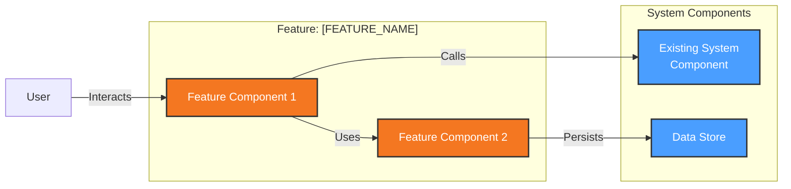
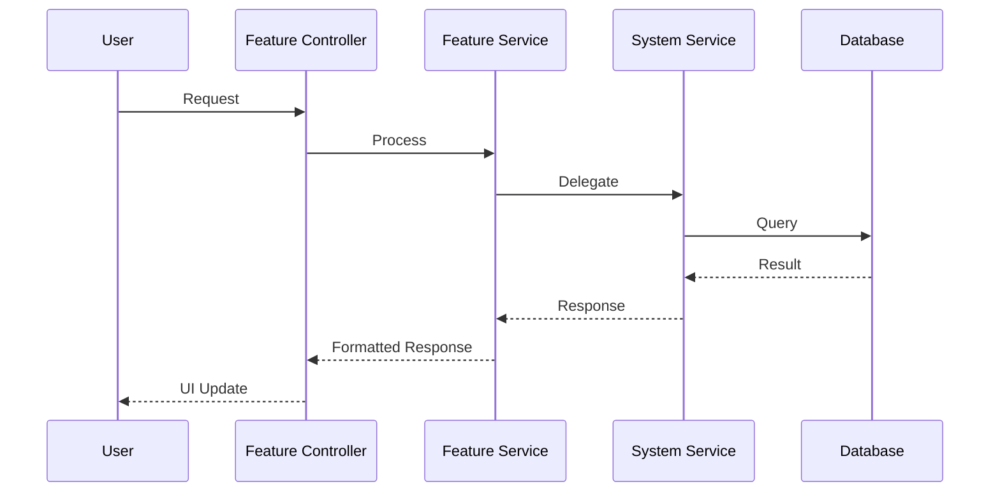

# Feature Architecture Description: [FEATURE_NAME]

**Version**: 1.0 | **Created**: [DATE] | **Last Updated**: [DATE]  
**Feature Branch**: [BRANCH_NAME]  
**System AD Reference**: [AD.md](../../AD.md)  
**Feature ADR Reference**: [adr.md](adr.md)

---

## 1. Feature Overview

### 1.1 Purpose

[Brief description of what this feature does and why it exists]

### 1.2 Scope

**In Scope:**

- [Specific functionality included]
- [User interaction patterns]

**Out of Scope:**

- [Explicitly excluded functionality]
- [Deferred to future iterations]

### 1.3 System Architecture Alignment

**Aligned System ADRs:**

- ADR-XXX: [Title] - [How this feature aligns]
- ADR-YYY: [Title] - [How this feature aligns]

**Feature-Specific ADRs:**

- See [adr.md](adr.md) for feature-level decisions

---

## 2. Feature Context

### 2.1 Integration Points

| System Component | Integration Type | Data Flow | Protocol |
|------------------|------------------|-----------|----------|
| [Component from System AD] | [How feature integrates] | [In/Out/Bidirectional] | [e.g., REST] |

### 2.2 External Dependencies (Feature-Specific)

| Dependency | Purpose | Fallback |
|------------|---------|----------|
| [SERVICE] | [Why needed for this feature] | [Degradation strategy] |

### 2.3 Context Diagram (Feature Scope)



---

## 3. Feature Functional Design

### 3.1 New/Modified Components

| Component | Change Type | Responsibility | System Component Affected |
|-----------|-------------|----------------|---------------------------|
| [COMPONENT_1] | New | [What it does] | [Which system component it extends/uses] |
| [COMPONENT_2] | Modified | [What changes] | [Existing component being modified] |

### 3.2 Component Interactions



### 3.3 Functional Boundaries

**Feature DOES:**

- [Specific capability 1]
- [Specific capability 2]

**Feature does NOT:**

- [Explicitly excluded - system handles elsewhere]
- [Deferred functionality]

---

## 4. Feature Data Design

### 4.1 New/Modified Entities

| Entity | Change Type | Owner | Relationship to System Entities |
|--------|-------------|-------|--------------------------------|
| [ENTITY_1] | New | Feature Service | [References SystemEntity via FK] |
| [ENTITY_2] | Extended | System Service | [Adds new fields] |

### 4.2 Data Flow

**Key Feature Data Flows:**

1. **[Flow Name]**: [Source] -> [Transformation] -> [Destination]

### 4.3 Data Validation

| Field/Entity | Validation Rule | Error Handling |
|--------------|-----------------|----------------|
| [FIELD] | [Rule] | [How errors are handled] |

---

## 5. Feature Concurrency Considerations

### 5.1 Async Operations

| Operation | Type | Rationale |
|-----------|------|-----------|
| [OPERATION] | [Sync/Async/Background] | [Why this approach] |

### 5.2 Coordination with System

- **Shared Resources**: [What system resources this feature uses]
- **Locking Strategy**: [How conflicts are prevented]
- **Event Publishing**: [What events this feature emits to system]

---

## 6. Feature Development Impact

### 6.1 Code Location

```text
project-root/
├── src/
│   ├── features/
│   │   └── [feature-name]/     # New feature code
│   │       ├── controllers/
│   │       ├── services/
│   │       ├── models/
│   │       └── __tests__/
│   ├── services/
│   │   └── [modified-service]/ # Existing code modified
│   └── ...
└── ...
```

### 6.2 API Changes

| Endpoint | Change Type | Breaking? | Migration Path |
|----------|-------------|-----------|----------------|
| [ENDPOINT] | New | N/A | - |
| [ENDPOINT] | Modified | Yes/No | [How to migrate] |

### 6.3 Testing Strategy

- **Unit Tests**: [What to test at unit level]
- **Integration Tests**: [What system interactions to test]
- **E2E Tests**: [Key user journeys to validate]

---

## 7. Feature Deployment Considerations

### 7.1 Infrastructure Changes

| Change | Environment | Rationale |
|--------|-------------|-----------|
| [CHANGE] | [All/Prod only/etc.] | [Why needed] |

### 7.2 Feature Flags

| Flag | Default | Purpose |
|------|---------|---------|
| [FLAG_NAME] | [on/off] | [Gradual rollout strategy] |

### 7.3 Rollback Strategy

- **Rollback Trigger**: [What indicates need to rollback]
- **Rollback Steps**: [How to rollback safely]
- **Data Rollback**: [How to handle data if needed]

---

## 8. Feature Operational Considerations

### 8.1 Monitoring Additions

| Metric | Type | Alert Threshold |
|--------|------|-----------------|
| [METRIC] | [Counter/Gauge/Histogram] | [e.g., > 100 errors/min] |

### 8.2 Logging Additions

| Log Event | Level | Fields |
|-----------|-------|--------|
| [EVENT] | [INFO/WARN/ERROR] | [Key fields to log] |

### 8.3 Operational Runbook

- **Health Check**: [How to verify feature is working]
- **Common Issues**: [Known issues and resolutions]
- **Escalation**: [When to escalate to engineering]

---

## 9. Security & Performance (Feature-Specific)

### 9.1 Security Considerations

| Concern | Mitigation | Aligns with System ADR |
|---------|------------|------------------------|
| [CONCERN] | [How addressed] | [ADR-XXX or N/A] |

### 9.2 Performance Impact

| Metric | Expected Impact | Validation |
|--------|-----------------|------------|
| [e.g., API latency] | [e.g., +10ms] | [How to verify] |

---

## 10. ADR Summary (Feature-Level)

Detailed feature-level ADRs are in [adr.md](adr.md).

| ID | Decision | Status | Aligns with System ADR |
|----|----------|--------|------------------------|
| F-ADR-001 | [Title] | Accepted | [ADR-XXX or "Feature-specific"] |

---

## Appendix

### A. Spec Reference

- **Feature Spec**: [spec.md](spec.md)
- **Implementation Plan**: [plan.md](plan.md)

### B. System AD Sections Affected

- [Section 3.2 Functional View] - New components added
- [Section 3.3 Information View] - New entities added
- [Section 4.1 Security] - [If applicable]

### C. Migration Notes

[Any migration steps required when this feature is deployed]
